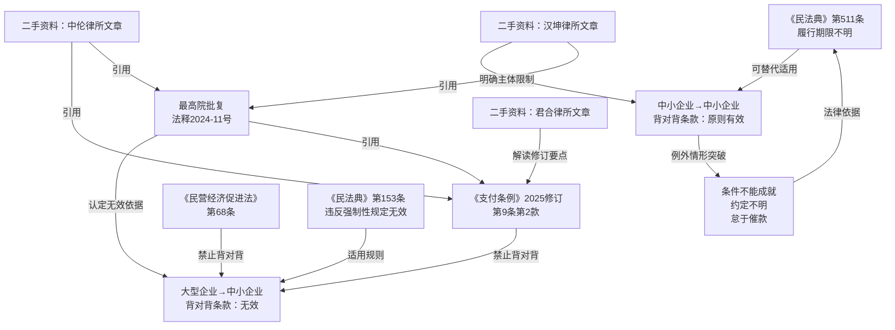

# 法律备忘录

**日期**：2026-04-12
**事由**：中小企业之间签署背对背（背靠背）付款条款的法律效力分析

---

## 一、核心结论

在建设工程分包合同中，**总包方（中小企业）与分包方（中小企业）**之间约定的背对背付款条款（即"收到业主付款后方向分包方付款"），**现行法律对此缺乏明确的强制性禁止规定**，法院主流倾向认定其**有效**，但在特定情形下（付款条件不能成就、约定不明）仍可突破该条款，要求总包方付款。

**关键主体区分**：上述结论前提是双方均为中小企业。若总包方为**大型企业**，背对背条款依法**无效**。

---

## 二、研究前提与适用范围

- **主体**：总包方（中小企业）+ 分包方（中小企业），均符合《中小企业划型标准规定》的中型、小型或微型企业标准
- **合同类型**：建设工程施工分包合同
- **法域**：中华人民共和国境内
- **时间范围**：以现行有效法规为准（截至2026年4月）
- **前提假设**：分包方已按约履行施工义务，争议仅在于付款条件是否成就

---

## 三、主要规则依据

### 1. 一般规则

**（1）合同自由原则** `[元典API]`

《中华人民共和国民法典》第一百五十三条（现行有效，2021年1月1日起施行）：

> 违反法律、行政法规的强制性规定的民事法律行为无效。但是，该强制性规定不导致该民事法律行为无效的除外。
> 违背公序良俗的民事法律行为无效。

背对背条款本质上是附条件的付款约定。在没有强制性法律规定明确禁止时，当事人真实意思表示形成的合同条款受合同自由原则保护。

**（2）履行期限不明的处理规则** `[元典API]`

《中华人民共和国民法典》第五百一十一条第四款（现行有效）：

> 履行期限不明确的，债务人可以随时履行，债权人也可以随时请求履行，但是应当给对方必要的准备时间。

部分法院认定背对背条款属于"履行期限约定不明"，据此允许分包方随时要求付款。

### 2. 特别规则

**（3）大型企业与中小企业之间的强制性规定** `[元典API]`

《保障中小企业款项支付条例》（2025年修订，2025年6月1日起施行）第九条第二款：

> 大型企业从中小企业采购货物、工程、服务，应当自货物、工程、服务交付之日起60日内支付款项；合同另有约定的，从其约定，**但应当按照行业规范、交易习惯合理约定付款期限并及时支付款项，不得约定以收到第三方付款作为向中小企业支付款项的条件或者按照第三方付款进度比例支付中小企业款项。**

同条例第七条：

> 机关、事业单位和大型企业不得要求中小企业接受不合理的付款期限、方式、条件和违约责任等交易条件，不得拖欠中小企业的货物、工程、服务款项。

**明确适用主体为"大型企业"，未及中小企业作为付款方的情形。**

**（4）最高院批复的适用范围** `[元典API]`

《最高人民法院关于大型企业与中小企业约定以第三方支付款项为付款前提条款效力问题的批复》（法释〔2024〕11号，2024年8月27日起施行）：

> 一、**大型企业**在建设工程施工、采购货物或者服务过程中，与中小企业约定以收到第三方向其支付的款项为付款前提的，因其内容违反《保障中小企业款项支付条例》第六条、第八条的规定，人民法院应当根据民法典第一百五十三条第一款的规定，认定该约定条款无效。

最高院明确：批复适用主体为"**大型企业与中小企业**之间"。

**（5）民营经济促进法** `[元典API]`

《中华人民共和国民营经济促进法》（2025年5月20日起施行）第六十八条：

> **大型企业**向中小民营经济组织采购货物、工程、服务等，应当合理约定付款期限并及时支付账款，不得以收到第三方付款作为向中小民营经济组织支付账款的条件。

同样以"大型企业"为义务主体。

---

## 四、分析

### 4.1 中小企业之间背对背条款是否受现行法规禁止？

**结论：不在现行强制性禁止范围内。**

现行规制体系存在清晰的主体边界：

| 规范文件 | 义务主体 | 权利主体 | 背对背禁止？ |
|---------|---------|---------|------------|
| 《支付条例》第7、9条 | 机关、事业单位、**大型企业** | 中小企业 | **是** |
| 最高院批复（法释〔2024〕11号） | **大型企业** | 中小企业 | **是** |
| 《民营经济促进法》第68条 | **大型企业** | 中小民营经济组织 | **是** |
| 中小企业对中小企业 | 中小企业 | 中小企业 | **无明文禁止** |

`[AI分析]` 立法目的在于防止大型企业利用优势地位转嫁付款风险。两个中小企业之间不存在法律预设的明显强弱地位差异，因此未纳入强制规制范围。

### 4.2 背对背条款在中小企业之间的效力判断

`[AI分析]` 按现行司法实践，中小企业之间的背对背条款效力分析如下：

**主流观点（有效）**：当事人系真实意思表示，不违反强制性法规，条款有效。总包商可以"业主未付款"为由暂缓付款。

**可突破条款的情形（来自案例）**：

1. **付款条件确定不能成就** `[元典API]`：若业主已明确拒绝付款、进入破产程序或工程已竣工多年无望收款，法院可依据民法典总则编司法解释第二十四条认定条件"不可能发生"，从而不适用背对背条款。（参见（2023）最高法民申160号）

2. **约定不明** `[元典API]`：若合同背对背条款表述模糊、无法确定明确的付款触发条件，法院可能认定为"履行期限不明"，依民法典第511条，分包方可随时要求付款。（参见（2025）吉01民终1301号）

3. **总包方未积极催收** `[元典API]`：部分案例中，法院认为总包方若未尽力催促业主付款，不能以背对背条款抗辩。（参见（2025）鲁民申244号）

4. **付款条件已成就** `[元典API]`：若业主已向总包方支付对应款项，付款条件已成就，总包方不得拒绝向分包方付款。（参见（2025）吉01民终1301号）

### 4.3 主体认定的重要性

`[AI分析]` 即使合同双方自我认定为"中小企业"，法律适用时仍需按**合同订立时**的企业规模类型认定（《支付条例》第三条）。若总包方实际属于大型企业，则背对背条款依法无效。建议在合同签署前核查双方的工商注册信息及规模类型。

---

## 五、实务观点

**中伦律师事务所** `[Tavily]`：以2020年9月1日《支付条例》施行为分水岭，《支付条例》施行前主流观点认可背靠背条款效力；施行后法院逐步否定**特定情形**下背靠背条款的效力，但规制主体主要针对大型企业。

**汉坤律师事务所** `[Tavily]`：批复第一条明确，适用范围限于"大型企业与中小企业之间"，中小企业与中小企业之间的背对背条款"只开了一个很小的切口"，不在批复规制范围内。

**君合律师事务所** `[Tavily]`：《支付条例》2025修订版第九条第二款的禁止对象明确为"大型企业"，未扩展至中小企业作为付款方的情形。

---

## 六、风险与不确定性

1. **大型企业认定风险**：若总包方在合同订立时实际属于大型企业（即使自我认为是中小企业），背对背条款将被认定无效。需按工信部《中小企业划型标准规定》核实规模。

2. **条款设计风险**：背对背条款若措辞模糊（如"参考业主回款比例支付"），有被认定为"约定不明"的风险，导致分包方可随时要求付款。

3. **催款义务风险**：总包方若未积极向业主催款，可能被法院认定怠于行使权利，削弱背对背条款的抗辩效力。

4. **条件不能成就风险**：业主陷入财务困境时，法院可能认定付款条件"确定不能成就"，排除背对背条款适用。

5. **立法趋势风险** `[AI分析]`：近年来立法明显向保护小微企业倾斜，不排除未来通过立法将禁止范围扩展至中小企业之间的合同。

6. **地区差异**：各地法院裁判尺度不统一，部分法院在特殊情形下即使双方均为中小企业，也可能基于公平原则限制背对背条款的适用。

---

## 七、结论与实务建议

**核心结论**：中小企业之间（如总包方与分包方均为中小企业）签署的背对背付款条款，**目前在法律层面不存在明确的强制性禁止规定**，原则上有效。但该条款并非铁板一块，在以下情形中可被突破：付款条件确定不能成就、约定不明、总包方怠于催款。

**实务建议**：

**对于总包方（约定背对背条款）**：
- 确认自身确属中小企业，避免被认定为大型企业而使条款无效
- 条款措辞应精确，明确付款触发条件（如"收到业主该部分工程款后N日内支付"）
- 负有积极催收义务，书面留存向业主催款的记录
- 合同中约定业主违约或无力付款时的应急付款安排

**对于分包方（接受背对背条款）**：
- 谈判争取设定最长等待期限（如"业主付款后30日内，或自工程竣工验收后XX月内，取较早者"）
- 若发现业主已向总包支付对应款项，及时主张付款条件已成就
- 若等待超过合理期限，可主张条件不能成就或条款约定不明，要求总包方直接付款

---

## 八、主要法规依据清单

**一手权威资料（法律文件）**：

〔1〕《中华人民共和国民法典》第一百五十三条（现行有效，2021年1月1日起施行）

〔2〕《中华人民共和国民法典》第五百一十一条第四款（现行有效，2021年1月1日起施行）

〔3〕《保障中小企业款项支付条例》（国令第802号，2025年修订版，自2025年6月1日起施行）第三条、第七条、第九条第二款

〔4〕《中华人民共和国民营经济促进法》，2025年4月30日发布，自2025年5月20日起施行，第六十八条

〔5〕《最高人民法院关于大型企业与中小企业约定以第三方支付款项为付款前提条款效力问题的批复》，法释〔2024〕11号，自2024年8月27日起施行

**一手权威资料（司法案例）**：

〔6〕某建筑公司与某装饰公司建设工程分包合同纠纷，某二审法院（2024）鄂01民终15700号民事判决书（背对背条款认定无效，当事人为大型企业对中小企业）

〔7〕某公司与某公司分包合同纠纷，山东省某法院（2025）鲁民申244号（讨论承包方催款义务与背靠背条款效力）

〔8〕易某公司与联某公司分包合同纠纷，吉林省长春市中级人民法院（2025）吉01民终1301号（付款条件成就认定）

**二手参考资料**：

〔9〕中伦律师事务所：《最高人民法院关于"背靠背"条款效力问题批复的思考》，载中伦律师事务所官网。

〔10〕汉坤律师事务所：《最高院批复背景下"背靠背"条款效力的研究》，载汉坤律师事务所官网。

〔11〕君合律师事务所：《〈保障中小企业款项支付条例〉修订要点解读及实务法律问题研究》，载君合律师事务所官网。

---

## 九、关键资料溯引图

