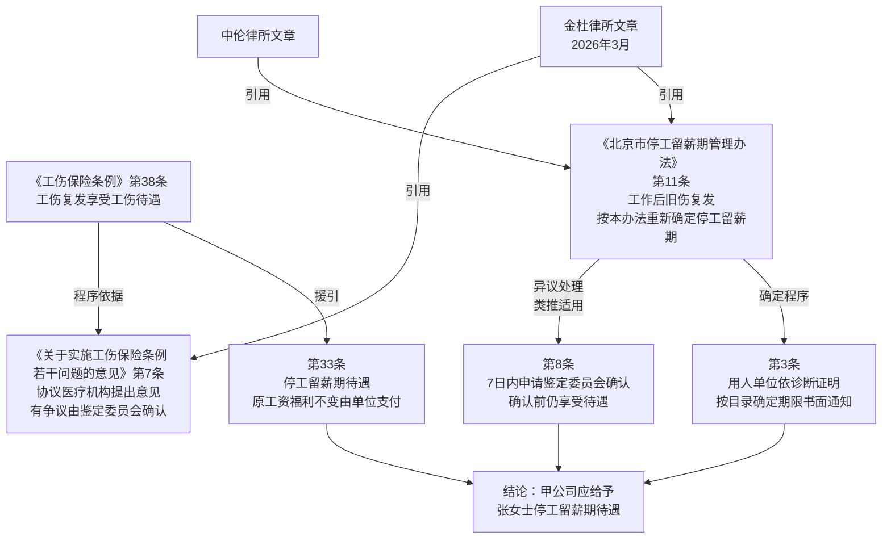

# 法律备忘录

**日期**：2026-04-13
**收件人**：内部研究使用
**发件人**：
**事由**：工伤职工工伤复发后再次休假，甲公司是否应给予停工留薪期待遇

---

## 一、核心结论

| 问题 | 结论 |
|------|------|
| 工伤复发是否可再次享受停工留薪期待遇？ | **是**，法律明确支持 |
| 仅凭医院诊断证明是否足以触发停工留薪期待遇？ | **较强观点：是**（北京实践中以医疗机构诊断为主要依据），但甲公司对此有异议权和申请鉴定委员会确认的权利 |
| 甲公司应给予停工留薪期待遇吗？ | **应当给予**；但若甲公司在7日内向区劳动能力鉴定委员会申请确认，确认结论作出前仍应先行给予停工留薪期待遇 |

**核心理由**：《工伤保险条例》第38条明确，工伤复发确认需要治疗的，享受包含停工留薪期待遇（第33条）在内的工伤待遇。《北京市工伤职工停工留薪期管理办法》第11条进一步规定，工伤职工从事工作后旧伤复发，需要重新确定停工留薪期的，按本办法执行——即由用人单位根据工伤医疗机构诊断证明确定新的停工留薪期并书面通知职工。张女士已由具备合法资质的医院出具"属工伤复发"诊断证明，甲公司应据此给予停工留薪期待遇；若对工伤复发认定有异议，应在7日内申请劳动能力鉴定委员会确认，但结论作出前仍应给予待遇。

---

## 二、研究前提与适用范围

- **主体**：张女士，北京市海淀区甲公司员工
- **事实前提**：
  - 2021年9月工伤，经劳动能力鉴定委员会确认九级伤残
  - 停工留薪期届满后，2022年5月已返岗工作
  - 2026年2月，工伤部位疼痛，就诊医院（具备诊断工伤复发合法资质）出具"属工伤复发"诊断证明
- **适用法域**：中国大陆，北京市，工伤保险法律
- **适用法律**：《工伤保险条例》（2010年修订，现行有效）、《北京市工伤职工停工留薪期管理办法》（2004年施行，现行有效）、《北京市实施〈工伤保险条例〉若干规定》（现行有效）、《关于实施〈工伤保险条例〉若干问题的意见》（现行有效）
- **说明**：本案张女士已于2022年5月返岗，属于"从事工作后旧伤复发"的典型场景，区别于停工留薪期满后仍持续治疗但未返岗的情形

---

## 三、主要规则依据

### 1. 一般规则——工伤复发待遇的法律基础

**《工伤保险条例》（2010年修订）第三十八条**（现行有效）：

> 工伤职工工伤复发，确认需要治疗的，享受本条例第三十条、第三十二条和第三十三条规定的工伤待遇。

**《工伤保险条例》第三十三条**（现行有效）：

> 职工因工作遭受事故伤害或者患职业病需要暂停工作接受工伤医疗的，在停工留薪期内，原工资福利待遇不变，由所在单位按月支付。
> 停工留薪期一般不超过12个月。伤情严重或者情况特殊，经设区的市级劳动能力鉴定委员会确认，可以适当延长，但延长不得超过12个月。工伤职工评定伤残等级后，停发原待遇，按照本章的有关规定享受伤残待遇。工伤职工在停工留薪期满后仍需治疗的，继续享受工伤医疗待遇。

**《关于实施〈工伤保险条例〉若干问题的意见》第七条**（现行有效）：

> 条例第三十六条（现对应第三十八条）规定的工伤职工旧伤复发，是否需要治疗应由治疗工伤职工的协议医疗机构提出意见，有争议的由劳动能力鉴定委员会确认。

### 2. 特别规则——北京市工伤复发停工留薪期的确认程序

**《北京市工伤职工停工留薪期管理办法》第十一条**（现行有效，2004年1月1日施行）：

> 工伤职工从事工作后旧伤复发，需要重新确定停工留薪期的，按本办法执行。

**《北京市工伤职工停工留薪期管理办法》第三条**（现行有效）：

> 工伤职工应及时将工伤医疗机构出具的诊断证明或者休假证明报送给所在单位。由用人单位根据工伤医疗机构的诊断证明，按照《停工留薪期目录》（见附件），确定工伤职工的停工留薪期，并书面通知工伤职工本人。

**《北京市工伤职工停工留薪期管理办法》第八条**（现行有效）：

> 工伤职工申请延长停工留薪期的，应在期满前3日内向本单位提出书面申请并提交工伤医疗机构出具的休假证明，经用人单位同意后，可以延长停工留薪期……用人单位对工伤职工申请延长停工留薪期有异议的，**应在接到申请后7日内向区、县劳动能力鉴定委员会申请确认，用人单位未提出申请的，视为同意延长停工留薪期。劳动能力鉴定委员会做出确认结论前工伤职工享受停工留薪期的待遇。**

**《北京市工伤职工停工留薪期管理办法》第十条**（现行有效）：

> 工伤职工停工留薪期满，应当进行劳动能力鉴定，停发停工留薪期待遇。需要继续治疗的，必须有工伤医疗机构的休假证明，其工伤医疗费用予以报销，但不享受停工留薪期待遇。由用人单位发给生活津贴，标准不得低于病假工资。

**《北京市实施〈工伤保险条例〉若干规定》第二十一条**（现行有效）：

> 工伤职工需要暂停工作接受工伤医疗的，在停工留薪期内，原工资福利待遇不变，由所在单位按月支付。工伤职工停工留薪期一般不超过12个月，按照《条例》规定有正当理由的可以适当延长，但延长不得超过12个月。停工留薪期具体时限按照本市有关规定执行。

---

## 四、分析

### 4.1 张女士是否符合工伤复发的前提条件

《工伤保险条例》第38条的适用前提是"工伤复发，确认需要治疗"。张女士满足以下要件：

1. **主体适格**：已经劳动能力鉴定委员会认定为工伤（九级伤残），具有工伤职工身份；
2. **已返岗**：停工留薪期届满后于2022年5月已返岗工作，属于"从事工作后旧伤复发"，而非停工留薪期的延续；
3. **医疗机构诊断**：具备诊断工伤复发合法资质的医院出具"属工伤复发"诊断证明，属于《意见》第7条所述"由协议医疗机构提出意见"的情形。

上述三要件均满足，张女士符合工伤复发的事实前提。

### 4.2 工伤复发是否可再次享受停工留薪期待遇

**文义解释**：《工伤保险条例》第38条明确，工伤复发确认需要治疗的，"享受本条例第三十条、第三十二条和**第三十三条**规定的工伤待遇"。第33条第1款即停工留薪期待遇（原工资福利不变，由用人单位按月支付）。法条文义清晰，工伤复发后可再次享受停工留薪期待遇，无需争议。

**体系解释**：第10条规定的"停工留薪期满，不享受停工留薪期待遇"针对的是首次工伤停工留薪期届满后继续治疗（未返岗）的情形；张女士已返岗工作，构成"旧伤复发"，适用第11条（工作后旧伤复发重新确定停工留薪期），而非第10条的适用场景。两条并不冲突。（分析推断）

### 4.3 北京市工伤复发停工留薪期的确定程序

根据《北京市停工留薪期管理办法》第11条，工作后旧伤复发需重新确定停工留薪期的，按本办法（即第3条）执行：

- **职工义务**：将医疗机构出具的诊断证明或休假证明报送给所在单位
- **用人单位义务**：根据工伤医疗机构诊断证明，按《停工留薪期目录》确定停工留薪期，**书面通知职工**

张女士已提交医院出具的工伤复发诊断证明，已完成职工一方的程序性义务。甲公司依法应据此确定新的停工留薪期并书面通知。

### 4.4 甲公司对工伤复发认定持异议的处理路径

甲公司认为"仅凭医院诊断证明不足以认定工伤复发"。对此分析如下：

**较强观点（支持张女士）**：《意见》第7条规定，工伤复发是否需要治疗"由治疗工伤职工的协议医疗机构提出意见"，仅在"有争议"时才由劳动能力鉴定委员会确认。在无争议或甲公司不启动鉴定程序的情况下，协议医疗机构出具的工伤复发诊断意见具有直接效力。北京司法实践中，法院倾向于依据医疗机构诊断材料认定工伤复发（参见中伦律所文章）。

**甲公司的救济途径**：参照第8条（关于延长停工留薪期有异议的处理机制，可类推适用于工伤复发确认争议），甲公司若对工伤复发认定有异议，应**在7日内**向区劳动能力鉴定委员会申请确认；若甲公司不申请，则视为认可，应按工伤复发处理。**劳动能力鉴定委员会作出确认结论前，工伤职工（张女士）仍应享受停工留薪期待遇**。（分析推断：第8条明确针对"延长停工留薪期有异议"，类推适用至工伤复发停工留薪期争议情形，北京实践中有此参照，但属于司法解释层面尚未明确之处，存在不确定性）

### 4.5 停工留薪期标准的确定

工伤复发后停工留薪期期限的确定，按《北京市停工留薪期管理办法》第3条（依诊断证明按《停工留薪期目录》确定）、第6条（未列入目录的不超过6个月）执行。如伤情严重或情况特殊，须经市级劳动能力鉴定委员会确认方可延长，最长不超过24个月（原12个月 + 延长12个月）。

---

## 五、实务观点

**据金杜律师事务所《北京市工伤复发认定及相关问题的实务问答》**（https://www.kwm.com/cn/zh/insights/latest-thinking/faqs-on-the-recognition-of-work-related-injury-recurrence-and-related-issues-in-beijing.html，2026年3月16日）：

> 对于工伤复发的判定主体和流程，北京市并未明确工伤复发的认定部门。在司法实践中，如果当地劳动能力鉴定委员会不对"职工是否属于工伤复发"作出认定的，多数法院倾向于依据医疗机构出具的诊断材料（如：诊断证明等）对"职工是否属于工伤复发"作出认定。具体而言，根据司法实践的尺度，如果"职工在停工留薪期满后提交的、由医疗机构出具的诊断证明所载明的病情"与"职工初次发生的工伤病情"有部分重合或者全部重合的，法院倾向于认定职工属于"工伤复发"。

该文章进一步指出，《北京市停工留薪期管理办法》第10条（停工留薪期满不享受停工留薪期待遇）与第11条（工作后旧伤复发按本办法执行）适用于不同场景：第10条针对停工留薪期满后持续治疗的职工；第11条针对已返岗工作后再次复发的职工，后者可重新享受停工留薪期待遇。

**据中伦律师事务所《常见的工伤问题，你知道的有多少？》**（https://www.zhonglun.com/research/articles/7363.html）：

> 对于工伤复发的判定主体，北京市并未明确工伤复发的认定部门，在司法实践中多数法院倾向于依据医疗机构出具的诊断材料对工伤复发作出认定；对于工伤复发后的停工留薪期，按北京市停工留薪期管理办法执行。

---

## 六、风险与不确定性

1. **"协议医疗机构"的认定**：国家层面《意见》第7条使用的是"协议医疗机构"，而张女士就诊医院仅描述为"具备诊断工伤复发的合法资质"。北京市实践中，若就诊医院非工伤保险协议医疗机构，甲公司可能以此为由主张诊断意见不符合程序要求。建议核实就诊医院是否为北京市工伤保险协议医疗机构。

2. **仲裁/诉讼中第8条的类推适用**：《北京市停工留薪期管理办法》第8条明文规定的是"延长停工留薪期有异议"的处理程序（7日内申请鉴定委员会确认、确认前仍享受待遇），对于工伤复发停工留薪期争议能否类推适用第8条，北京尚无明文规定，存在一定法律不确定性，但实务中有此倾向。

3. **停工留薪期期限的争议**：工伤复发后停工留薪期的具体期限，须按《停工留薪期目录》确定，若甲公司与张女士对期限认定存在分歧，需进一步依据诊断证明载明的伤情和目录对照确定。

4. **九级伤残后是否影响停工留薪期期限**：初次工伤评定伤残等级（九级）后，停工留薪期就此停发，但工伤复发后的停工留薪期系独立重新计算，与初次伤残等级无直接关联。

5. **诊断证明内容的具体性**：法院和仲裁委在认定工伤复发时，通常要求诊断证明所载病情与初次工伤病情有部分或全部重合。若诊断证明内容较为笼统（仅写"属工伤复发"而无具体病情描述），甲公司可能主张诊断依据不足。

---

## 七、结论与实务建议

**结论**：甲公司应当给予张女士工伤复发期间的停工留薪期待遇。《工伤保险条例》第38条明确赋予工伤复发职工享受停工留薪期待遇的权利，《北京市停工留薪期管理办法》第11条亦明确工作后旧伤复发可重新确定停工留薪期。在张女士已提交具备合法资质的医院出具的"属工伤复发"诊断证明的情况下，甲公司应按医疗机构诊断证明确定新的停工留薪期并书面通知张女士。若甲公司对工伤复发认定有异议，应在7日内申请区劳动能力鉴定委员会确认，确认结论作出前张女士仍享受停工留薪期待遇。

**实务建议**：

| 主体 | 建议 |
|------|------|
| **甲公司** | ①核实就诊医院是否为北京市工伤保险协议医疗机构；②若认可工伤复发，依据诊断证明和《停工留薪期目录》确定新的停工留薪期，书面通知张女士；③若对工伤复发认定有异议，在收到张女士申请后7日内向区劳动能力鉴定委员会申请确认，期间仍应给予停工留薪期待遇，避免拒不支付带来的法律风险 |
| **张女士** | ①及时向甲公司提交书面申请及医院诊断证明；②留存所有就医证明和往来沟通记录；③若甲公司拒绝支付，可向海淀区劳动人事争议仲裁委员会申请仲裁 |

---

## 八、主要法规依据清单

**一手权威资料（法律文件）**：

〔1〕《工伤保险条例》（2010年修订），第三十条、第三十三条、第三十八条。

〔2〕《北京市工伤职工停工留薪期管理办法》，京劳社工发〔2003〕195号，2004年1月1日施行，第三条、第八条、第十条、第十一条。

〔3〕《北京市实施〈工伤保险条例〉若干规定》，第二十一条。

〔4〕《关于实施〈工伤保险条例〉若干问题的意见》，第七条。

〔5〕《北京市工伤康复管理暂行办法》，京人社工发〔2026〕1号，2026年1月8日发布，第六条（旧伤复发纳入康复对象范围）、第九条（工伤康复期间享受停工留薪期待遇）。

**二手参考资料**：

〔6〕金杜律师事务所：《北京市工伤复发认定及相关问题的实务问答》，2026年3月16日，https://www.kwm.com/cn/zh/insights/latest-thinking/faqs-on-the-recognition-of-work-related-injury-recurrence-and-related-issues-in-beijing.html

〔7〕中伦律师事务所：《常见的工伤问题，你知道的有多少？》，https://www.zhonglun.com/research/articles/7363.html

---

## 九、关键资料溯引图

