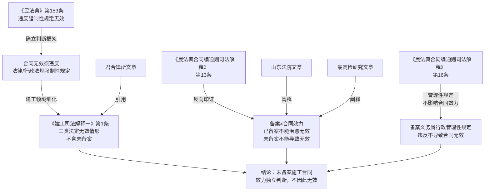

# 法律备忘录

**日期**：2026-04-13
**收件人**：内部研究使用
**发件人**：
**事由**：建设工程施工合同未在行政主管部门备案，合同效力认定

---

## 一、核心结论

| 问题 | 结论 |
|------|------|
| 未备案的施工合同是否当然无效？ | **否**，未备案不导致合同无效 |
| 备案是合同生效要件吗？ | **否**，备案系行政管理性规定，不影响合同效力 |
| 合同效力应如何判断？ | 依据《民法典》第153条及《建工司法解释（一）》第1条，以主体资质、招标程序、规划审批等实质要件为准 |

**核心理由**：根据现行法律体系，施工合同备案依据的规范（建设部89号令及地方规章）均属**行政管理性规定**，而非效力性强制规范。《最高人民法院关于审理建设工程施工合同纠纷案件适用法律问题的解释（一）》第1条明确列举了导致施工合同无效的三类情形，**未包含"未备案"**。未备案的施工合同，其效力须依据合同本身的主体资质、招投标程序合法性等实质要件独立判断。

---

## 二、研究前提与适用范围

- **主体**：甲方（建设单位/发包方）与施工总包（具备相应资质的建筑施工企业）
- **假设**：双方签订的施工合同本身内容合法（主体具有相应资质、若需招标已依法招标、不存在《建工司法解释一》第1条所列无效情形）；唯一缺陷为未办理行政主管部门备案登记
- **适用法域**：中国大陆建设工程合同法律
- **时间范围**：适用法律为《民法典》（2021年1月1日施行）、《建工司法解释（一）》（2021年1月1日施行）、《民法典合同编通则司法解释》（2023年12月5日施行）
- **特别说明**：原《施工合同司法解释（一）》第21条（以备案中标合同作为结算依据）已被新解释删除，施工合同备案制度在全国多地亦已逐步取消

---

## 三、主要规则依据

### 1. 一般规则——合同效力的判断标准

**《中华人民共和国民法典》第一百五十三条**（现行有效，2021年1月1日施行）：

> 违反法律、行政法规的强制性规定的民事法律行为无效。但是，该强制性规定不导致该民事法律行为无效的除外。
> 违背公序良俗的民事法律行为无效。

**《中华人民共和国民法典》第五百零二条**（现行有效，2021年1月1日施行）：

> 依法成立的合同，自成立时生效，但是法律另有规定或者当事人另有约定的除外。
> 依照法律、行政法规的规定，合同应当办理批准等手续的，依照其规定。未办理批准等手续影响合同生效的，不影响合同中履行报批等义务条款以及相关条款的效力。应当办理申请批准等手续的当事人未履行义务的，对方可以请求其承担违反该义务的责任。

**《中华人民共和国民法典》第七百八十九条**（现行有效）：

> 建设工程合同应当采用书面形式。

**《最高人民法院关于适用〈中华人民共和国民法典〉合同编通则若干问题的解释》第十三条**（现行有效，2023年12月5日施行）：

> 合同存在无效或者可撤销的情形，当事人以该合同已在有关行政管理部门办理备案、已经批准机关批准或者已依据该合同办理财产权利的变更登记、移转登记等为由主张合同有效的，人民法院不予支持。

**《最高人民法院关于适用〈中华人民共和国民法典〉合同编通则若干问题的解释》第十六条**（现行有效）：

> 合同违反法律、行政法规的强制性规定，有下列情形之一，由行为人承担行政责任或者刑事责任能够实现强制性规定的立法目的的，人民法院可以依据民法典第一百五十三条第一款……认定该合同不因违反强制性规定无效：……（二）强制性规定旨在维护政府的税收、土地出让金等国家利益或者其他民事主体的合法利益而非合同当事人的民事权益，认定合同有效不会影响该规范目的的实现……

### 2. 特别规则——建设工程施工合同无效的法定情形

**《最高人民法院关于审理建设工程施工合同纠纷案件适用法律问题的解释（一）》第一条**（现行有效，2021年1月1日施行）：

> 建设工程施工合同具有下列情形之一的，应当依据民法典第一百五十三条第一款的规定，认定无效：
> （一）承包人未取得建筑业企业资质或者超越资质等级的；
> （二）没有资质的实际施工人借用有资质的建筑施工企业名义的；
> （三）建设工程必须进行招标而未招标或者中标无效的。
> 承包人因转包、违法分包建设工程与他人签订的建设工程施工合同，应当依据民法典第一百五十三条第一款及第七百九十一条第二款、第三款的规定，认定无效。

**《最高人民法院关于审理建设工程施工合同纠纷案件适用法律问题的解释（一）》第三条**（现行有效）：

> 当事人以发包人未取得建设工程规划许可证等规划审批手续为由，请求确认建设工程施工合同无效的，人民法院应予支持，但发包人在起诉前取得建设工程规划许可证等规划审批手续的除外。
> 发包人能够办理审批手续而未办理，并以未办理审批手续为由请求确认建设工程施工合同无效的，人民法院不予支持。

---

## 四、分析

### 4.1 施工合同备案的规范层级分析

施工合同备案义务的主要依据为：
- **建设部89号令**（2001年）——部门规章层级，要求房屋建筑和市政工程施工合同报建设行政主管部门备案
- 各省市住建部门出台的地方性备案管理办法——地方规章层级

上述规范均属**部门规章或地方规章**，效力层级低于《建筑法》（法律）和《建设工程质量管理条例》（行政法规）。依据民法典第153条，合同无效须以违反**法律、行政法规**层面的强制性规定为前提，违反部门规章不必然导致合同无效。（分析推断）

### 4.2 备案义务是否属于效力性强制规范

**文义解释**：《建筑法》第15条仅要求"订立书面合同、明确权利义务"，未规定备案为合同生效条件。《建设工程质量管理条例》亦无施工合同备案的效力性规定。

**体系解释**：《民法典》第502条区分了"法律行政法规要求办理批准手续"（可影响合同生效）与一般行政管理要求，仅前者才影响合同效力。施工合同备案依据的规章不属于"法律、行政法规"层面的批准手续要求，不能援引第502条认定合同未生效。

**目的论解释**：建设工程施工合同备案制度的立法目的在于**行政监管**——防止"黑白合同"、规范建筑市场、便于主管部门监督造价执行，而非以保护合同当事人民事权益为核心目的。依据《民法典合同编通则司法解释》第16条第2项，当强制性规定旨在维护行政管理秩序而非当事人民事权益时，认定合同有效不影响规范目的实现，合同不因此无效。

### 4.3 《建工司法解释（一）》的穷举性规定

《建工司法解释（一）》第1条明确列举了建设工程施工合同无效的全部情形（三类资质/招标问题），以及转包、违法分包情形。该条文采**穷举列举**方式，**未将未备案列为无效情形**。

第3条进一步规定，发包人未取得建设工程**规划许可证**的，合同可认定无效——而规划许可证属于《城乡规划法》（法律层级）的强制性要求，其效力高于备案规章。由此可见，即使是具有法律层级依据的行政手续，司法解释也设置了补正机制；对于仅有规章依据的备案义务，更无理由认定其为合同效力要件。

### 4.4 备案与合同效力的独立性

《民法典合同编通则司法解释》第13条规定：**合同已经备案，不能以此为由主张原本无效的合同有效**。反向推论同样成立：未备案，亦不能以此为由主张原本有效的合同无效。备案行为与合同效力系相互独立的法律评价维度。（分析推断）

### 4.5 实务中施工合同备案制度的演变

全国多地（如南宁市于2018年取消）已明确取消施工合同备案手续。《建工司法解释（一）》修订时亦删除了原第21条（以备案合同为结算依据），体现了司法层面对备案制度重要性的降级评价。这一趋势进一步佐证备案并非合同效力要件。（分析推断）

### 4.6 小结

未备案不构成《民法典》第153条或《建工司法解释（一）》第1条规定的无效情形。施工合同的效力，应依据双方主体资质是否适格、招投标程序是否合法、合同内容是否违反法律行政法规强制性规定等实质要件独立判断，与是否完成备案登记无关。

---

## 五、实务观点

**据君合律师事务所《2021年中国建设工程争议解决年度观察系列（一）》**（https://www.junhe.com/legal-updates/1618）：

> 由于施工合同备案制度已经取消，且大量工程建设行业实际也并未采取施工合同备案制度，原《施工合同司法解释（一）》第21条关于以备案的中标合同作为结算依据的条款已被删除。

此观点揭示了司法解释在制度层面对备案重要性的主动降低。

**据山东省法院（陈东强）《六类建设工程施工合同的效力认定》**（http://www.sdcourt.gov.cn/jnanszqfy/389687/389690/6078005/index.html）：

> 由于建设工程施工合同备案制度的逐步取消，备案合同将逐渐淡出法律争议视野。

**据最高人民检察院研究文章《备案合同与施工合同不一致，按哪个结算》**（https://www.spp.gov.cn/llyj/201702/t20170211_180712.shtml）：

> 对于不是必须招投标的项目，登记备案的合同并不必然作为双方的结算依据，应当探究当事人的真实意思和合同的实际履行情况。

以上观点均支持"备案不决定合同效力"的判断。

---

## 六、风险与不确定性

1. **"黑白合同"场景的特殊性**：若存在备案合同（"白合同"）与另行签订的未备案合同（"黑合同"）并存的情形，问题性质将转化为"阴阳合同"效力问题。此时，若工程需招标，两份合同均可能因背离中标合同实质性内容而被认定无效（《建工司法解释一》第2条）；若不需招标，则依当事人真实意思与实际履行合同确定结算依据。本备忘录仅讨论"唯一合同未备案"的情形。

2. **地方司法裁判的差异**：虽然主流裁判观点认为备案不影响合同效力，但个别地方法院早年裁判（尤其是2021年《建工司法解释（一）》施行前）可能存在将备案作为形式要件考量的判例，建议在具体项目中关注当地司法动态。

3. **备案义务未履行的行政责任**：未备案合同虽然有效，但当事人（尤其是建设单位）可能因违反建设行政管理规定而面临**行政处罚**（罚款、责令改正等），此行政责任与合同民事效力相互独立。

4. **工程结算争议中的证据风险**：备案合同通常由主管部门留存，具有较强的证据效力。未备案合同在工程价款结算争议中，当事人须自行保存合同文本及相关证据，举证难度相对较大。

---

## 七、结论与实务建议

**结论**：甲方与总包签订的建设工程施工合同，仅因未在行政主管部门备案，**不影响合同的法律效力**。合同是否有效，应依据主体资质是否适格、是否违反法律行政法规强制性规定等实质要件独立认定。

**实务建议**：

| 主体 | 建议 |
|------|------|
| 甲方（建设单位） | 尽快补办备案手续以消除行政违规风险；妥善保存合同文本、往来函件等证据，以备争议时证明合同真实内容 |
| 总包（施工单位） | 可主张合同有效并依约履行、主张工程款；若对方以"未备案"为由主张无效，可依据司法解释据理抗辩 |
| 双方 | 就主体资质、招投标合规性、工程规划许可证等实质要件进行自查，若存在《建工司法解释一》第1条、第3条所列情形，合同效力另当别论 |

---

## 八、主要法规依据清单

**一手权威资料（法律文件）**：

〔1〕《中华人民共和国民法典》（2020年），第一百五十三条、第五百零二条、第七百八十九条、第七百九十三条。

〔2〕《最高人民法院关于审理建设工程施工合同纠纷案件适用法律问题的解释（一）》，法释〔2020〕25号，2021年1月1日施行，第一条、第二条、第三条。

〔3〕《最高人民法院关于适用〈中华人民共和国民法典〉合同编通则若干问题的解释》，法释〔2023〕13号，2023年12月5日施行，第十三条、第十六条。

〔4〕《中华人民共和国建筑法》（2019年修正），第七条、第十五条。

**二手参考资料**：

〔5〕君合律师事务所：《2021年中国建设工程争议解决年度观察系列（一）》，载君合律师事务所官网，https://www.junhe.com/legal-updates/1618

〔6〕陈东强：《六类建设工程施工合同的效力认定》，载山东省法院官网，http://www.sdcourt.gov.cn/jnanszqfy/389687/389690/6078005/index.html

〔7〕作者不详：《备案合同与施工合同不一致，按哪个结算》，载中华人民共和国最高人民检察院官网，https://www.spp.gov.cn/llyj/201702/t20170211_180712.shtml

---

## 九、关键资料溯引图

