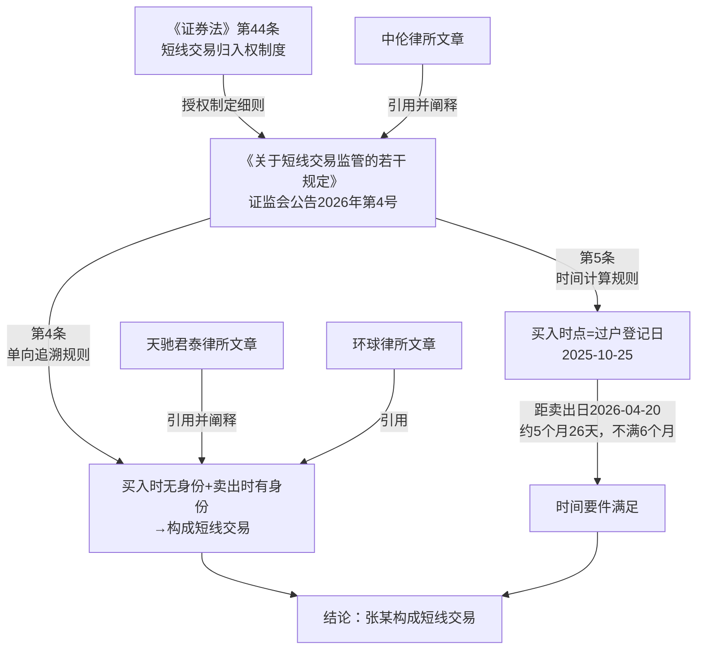

# 法律备忘录

**日期**：2026-04-13

**收件人**：内部研究使用

**发件人**：

**事由**：张某在买入上市公司股票后任职高管，并于6个月内卖出，是否构成短线交易

---

## 一、核心结论

| 分析维度 | 结论 |
|---------|------|
| 是否构成短线交易 | **构成** |
| 适用规则 | 《证券法》第44条 + 《关于短线交易监管的若干规定》（2026年4月7日施行）第4条、第5条 |
| 法律后果 | 张某卖出所得收益归公司所有，公司董事会应当收回 |

**核心理由**：依据2026年4月7日正式施行的《关于短线交易监管的若干规定》第4条，买入时不具备特定身份（董监高/大股东），但在买入后卖出时已具备该身份的，同样适用短线交易规定。同规定第5条明确，买入时点以证券过户登记日为准。张某于2025年10月25日过户登记（买入时点），至2026年4月20日卖出，历时约5个月26天，未满6个月，且卖出时已具备高管身份，构成短线交易。

---

## 二、研究前提与适用范围

- **主体**：张某，某A股上市公司员工，买入时非董监高、非大股东（持股20万股，需结合公司总股本判断是否达5%）
- **适用法域**：中国大陆证券法
- **时间范围**：行为发生于2025年9月至2026年4月，适用法律为《中华人民共和国证券法》（2019年修订，2020年3月1日施行）及《关于短线交易监管的若干规定》（2026年4月7日施行）
- **前提假设**：张某持有的20万股不达上市公司总股本5%，即买入时张某仅为普通股东，非大股东；题目所述"2022年买入"应为笔误，应为"2025年买入"（下文均以2025年买入为准）

---

## 三、主要规则依据

### 1. 一般规则——短线交易归入权制度

**《中华人民共和国证券法》（2019修订）第四十四条**（现行有效，2020年3月1日施行）：

> 上市公司、股票在国务院批准的其他全国性证券交易场所交易的公司持有百分之五以上股份的股东、董事、监事、高级管理人员，将其持有的该公司的股票或者其他具有股权性质的证券在买入后六个月内卖出，或者在卖出后六个月内又买入，由此所得收益归该公司所有，公司董事会应当收回其所得收益。但是，证券公司因购入包销售后剩余股票而持有百分之五以上股份，以及有国务院证券监督管理机构规定的其他情形的除外。
>
> 前款所称董事、监事、高级管理人员、自然人股东持有的股票或者其他具有股权性质的证券，包括其配偶、父母、子女持有的及利用他人账户持有的股票或者其他具有股权性质的证券。

**分析**：《证券法》第44条本身未明确"仅在卖出时具备特定身份"是否适用。该条款的文义为"持有百分之五以上股份的股东、董事、监事、高级管理人员"，从文义解释看，买入时为普通员工的张某，可能产生身份认定争议。因此，需进一步适用细化规定。

### 2. 特别规则——身份认定与时间计算

**《中国证券监督管理委员会关于短线交易监管的若干规定》第四条**（现行有效，2026年4月7日施行）：

> 特定身份投资者买入证券后六个月内卖出的，或者卖出后六个月内买入的，应当适用本规定。**投资者买入时不具备特定身份，但买入后卖出时具备的，应当适用本规定。**

**《中国证券监督管理委员会关于短线交易监管的若干规定》第五条**（现行有效，2026年4月7日施行）：

> 买入、卖出行为，是指支付对价买入导致证券数量增加，或为获取对价卖出导致证券数量减少的行为。**买入、卖出时点以证券过户登记日为准，法律、行政法规另有规定的，从其规定。**

**《中国证券监督管理委员会关于短线交易监管的若干规定》第二条**（现行有效）：

> 本规定所称特定身份投资者，是指持有上市公司、新三板挂牌公司百分之五以上股份的股东及上市公司、新三板挂牌公司的**董事、监事、高级管理人员**。

---

## 四、分析

### 4.1 适用法律的时间效力

本案卖出行为发生于2026年4月20日，《关于短线交易监管的若干规定》于2026年4月7日正式施行，卖出行为发生在新规施行之后，新规对本次卖出行为具有直接约束力。此外，买入行为（过户登记日2025年10月25日）发生在新规施行之前，但新规第4条明确规定了"单向追溯"规则，即无论买入时是否具备身份，只要卖出时具备即受约束，故新规对本案完整适用。

### 4.2 买入时点的认定

新规第5条明确规定：**买入时点以证券过户登记日为准**。

本案事实：
- 协议签署日：2025年9月30日
- 股票过户登记日：2025年10月25日

依据新规第5条，张某买入时点为**2025年10月25日**（过户登记日），而非协议签署日（9月30日）。

### 4.3 张某是否具备"特定身份"

**买入时**（2025年10月25日）：张某为普通员工，不属于董监高，亦非大股东，**不具备特定身份**。

**卖出时**（2026年4月20日）：张某已于2026年2月经董事会任命为副总经理（高级管理人员），**已具备特定身份**。

依据新规第4条第2句："投资者买入时不具备特定身份，但买入后卖出时具备的，应当适用本规定。"——**张某的情形完全符合该条款描述**。

### 4.4 六个月期间的计算

- 买入时点（过户登记日）：2025年10月25日
- 卖出时点：2026年4月20日
- 期间：约5个月26天，**未满6个月**

短线交易的判断标准为"买入后六个月内卖出"，张某在买入后不满6个月即卖出，满足时间要件。

### 4.5 综合判断

结合以上分析：
1. **主体要件**：卖出时张某已为高级管理人员，符合新规第2条规定的特定身份投资者，且新规第4条明确买入时不具备身份、卖出时具备的同样适用；
2. **时间要件**：从买入时点（2025年10月25日）至卖出日（2026年4月20日），历时未满6个月；
3. **行为要件**：买入后六个月内卖出同一公司股票；
4. **豁免情形**：新规第6条列举的豁免情形（如继承、捐赠、做市业务等）均不适用于本案。

**三个要件均满足，不存在豁免事由，构成短线交易。**（分析推断）

---

## 五、实务观点

**据中伦律师事务所《短线交易新规，对上市公司大股东及董监高影响的实务分析》**（https://www.zhonglun.com/research/articles/55814.html）：

> 《新规》确立了"单向追溯"规则：主体取得大股东或董监高身份后，需回溯考察此前6个月的买入行为，若此前6个月内有买入，在6个月内卖出的，则构成短线交易；但此前的卖出行为，不影响取得身份后未来的买入行为。即，只追溯买入，不追溯卖出。

**据天驰君泰律师事务所《浅析〈关于短线交易监管的若干规定〉的影响及规范化应对》**（https://www.tiantailaw.com/CN/12371-35937.aspx）：

> 《规定》第二条则明确规定，即便买入时不具备大股东或董监高身份、但卖出时已具备的，同样纳入规制范围。

**据环球律师事务所（https://www.glo.com.cn/Content/2023/11-08/1705027810.html）**：

> 在买入/卖出股票时不具备上市公司董监高身份，卖出/买入股票时具备的，构成短线交易。

以上三家律所文章均明确支持本备忘录的核心结论。

---

## 六、风险与不确定性

1. **新规时间效力的溯及问题**：新规于2026年4月7日施行，买入行为（过户登记）发生于2025年10月25日，即新规施行之前。新规第4条的"单向追溯"规则是否对新规施行前的买入行为同样适用，理论上可能存在争议。但本案中，决定性的"卖出"行为发生于2026年4月20日（新规施行后），且新规第12条未设过渡期例外，监管机构可能以"行为整体发生在新规施行后"为由适用新规，该风险较小。

2. **持股比例问题**：若张某持有的20万股达到上市公司总股本5%以上，则张某在**买入时**即已构成大股东，情形更为简单直接——届时买入时即具备特定身份，更明确构成短线交易。上述分析以"买入时不达5%"为前提。

3. **任职日期的精确性**：题目仅称"2026年2月"任命，具体日期不详。若2026年2月任职日至2026年4月20日卖出日之间不足某一特定期间，理论上可能影响实务中监管机构的执法自由裁量，但不影响短线交易构成的法律结论（判断标准为买入日至卖出日，而非任职日至卖出日）。

4. **新规施行前的法律适用**：在新规施行前（即2020年3月至2026年4月6日之间），《证券法》第44条并未明确"仅卖出时具备身份"是否适用，实务中存在分歧。新规正式解决了这一争议，故本案适用新规不存在实质障碍。

---

## 七、结论与实务建议

**结论**：张某的行为构成《证券法》第44条规定的短线交易。其以协议转让方式买入该上市公司股票，过户登记日为2025年10月25日；2026年2月任职高管后，于2026年4月20日（距买入过户登记日不满6个月）卖出，依据《关于短线交易监管的若干规定》第4条"单向追溯"规则及第5条"过户登记日为准"规则，构成短线交易。

**实务建议**：

| 主体 | 建议 |
|------|------|
| 张某 | 主动向公司董事会申报并缴纳全部所得收益；若主动向证监会报告并缴纳，可适用从轻、减轻或不予行政处罚（新规第11条第2款） |
| 公司董事会 | 依《证券法》第44条第3款，应当在收到请求后30日内收回张某的短线交易所得收益 |
| 公司合规部门 | 建立高管任职前的持股登记审查机制，任职前6个月内有买入行为的，在任职前应及时披露并作出合规安排，避免触发短线交易 |

---

## 八、主要法规依据清单

**一手权威资料（法律文件）**：

〔1〕《中华人民共和国证券法》（2019年修订），第四十四条，2020年3月1日施行。

〔2〕《中国证券监督管理委员会关于短线交易监管的若干规定》，中国证券监督管理委员会公告〔2026〕4号，2026年3月6日发布，2026年4月7日施行，第二条、第四条、第五条、第六条、第十一条。

**二手参考资料**：

〔3〕中伦律师事务所：《短线交易新规，对上市公司大股东及董监高影响的实务分析》，载中伦律师事务所官网，https://www.zhonglun.com/research/articles/55814.html

〔4〕天驰君泰律师事务所：《浅析〈关于短线交易监管的若干规定〉的影响及规范化应对》，载天驰君泰律师事务所官网，https://www.tiantailaw.com/CN/12371-35937.aspx

〔5〕环球律师事务所：《上市公司董监高被认定为构成违规短线交易的情形》，载环球律师事务所官网，2023年11月8日，https://www.glo.com.cn/Content/2023/11-08/1705027810.html

〔6〕贝壳财经/新京报：《短线交易新规今日正式施行，六个核心问题带你快速读懂》，2026年4月7日，https://news.qq.com/rain/a/20260407A0642W00

---

## 九、关键资料溯引图

