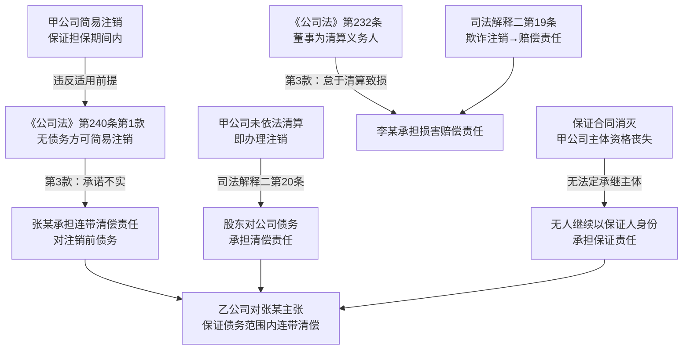

# 法律备忘录

**日期**：2026-04-13
**收件人**：内部研究使用
**发件人**：
**事由**：有限责任公司甲公司在保证担保存续期间内，由股东张某办理简易注销，董事为李某；甲公司注销后，乙公司（债权人/主债务人的债权人）可向哪些主体主张权利，主张何种责任

---

## 一、核心结论

| 分析维度 | 结论 |
|---------|------|
| 甲公司注销后保证合同是否继续有效 | **保证合同不因甲公司注销而消灭，但甲公司主体资格已消灭，无法继续直接履行** |
| 是否有主体继续承担保证责任 | **不存在承继保证合同权利义务的法定主体**；张某（全体股东）须对注销前债务承担连带责任（依据：《公司法》第240条第3款），该责任在性质上为损害赔偿/清偿替代责任，而非保证责任本身的继承 |
| 张某的法律责任 | **连带清偿责任**（承诺书不实+简易注销违规双重路径） |
| 李某（董事）的法律责任 | **赔偿责任**——若李某未依法履行清算义务（清算义务人），且该怠于清算给债权人造成损失，则依《公司法》第232条第3款承担赔偿责任 |

**核心理由**：甲公司存续期间为乙公司之债权人提供了有效保证担保，该保证担保属于对外的"债务"（或或有负债）。甲公司在保证期间内由股东张某办理简易注销，违反了简易注销"无债权债务或已清偿"的适用条件，张某在承诺书中关于"无债务"的承诺不实，依《公司法》第240条第3款，应对注销登记前的债务承担连带责任，债权人可据此向张某主张清偿。李某作为董事，是法定清算义务人，若其未按《公司法》第232条规定及时履行清算义务，导致债权人损失，亦须承担相应赔偿责任。

---

## 二、研究前提与适用范围

- **主体**：甲公司（有限责任公司，已注销），股东张某（持有甲公司股权，参与签署简易注销承诺书），董事李某（甲公司唯一/主要董事，清算义务人）
- **适用法域**：中国大陆公司法、民法典担保法
- **时间范围**：甲公司注销行为发生时间未明，适用《中华人民共和国公司法》（2023修订，2024年7月1日施行）及相关司法解释
- **前提假设**：
  1. 甲公司在保证合同有效期内办理了简易注销，彼时保证合同尚未履行完毕（保证期间未届满、主债务尚在）
  2. 张某为甲公司全体股东或代表全体股东签署了简易注销承诺书
  3. 乙公司为被保证的债权人（甲公司为乙公司的债务人/第三方债务人向乙公司提供保证担保）
  4. 简易注销发生时，甲公司存在尚未履行的保证担保义务，即存在或有债务

---

## 三、主要规则依据

### 1. 一般规则

**《中华人民共和国公司法》（2023修订）第二百四十条**（现行有效，2024年7月1日施行）：

> 公司在存续期间未产生债务，或者已清偿全部债务的，经全体股东承诺，可以按照规定通过简易程序注销公司登记。
>
> 通过简易程序注销公司登记，应当通过国家企业信用信息公示系统予以公告，公告期限不少于二十日。公告期限届满后，未有异议的，公司可以在二十日内向公司登记机关申请注销公司登记。
>
> **公司通过简易程序注销公司登记，股东对本条第一款规定的内容承诺不实的，应当对注销登记前的债务承担连带责任。**

**分析**：简易注销的适用前提是"未产生债务，或者已清偿全部债务"。甲公司在保证担保存续期间内申请简易注销，彼时甲公司作为保证人承担着对乙公司的或有债务（保证债务），属于"已产生债务（或有负债）但尚未清偿"，不满足简易注销适用条件。全体股东在承诺书中作出"无债务"承诺，与实际情况不符，属于"承诺不实"，依第240条第3款，应对注销前债务承担连带责任。（分析推断）

### 2. 特别规则

**《最高人民法院关于适用〈中华人民共和国公司法〉若干问题的规定（二）》（2020修正）第十九条**（现行有效，2021年1月1日施行）：

> 有限责任公司的股东、股份有限公司的董事和控股股东，以及公司的实际控制人在公司解散后，恶意处置公司财产给债权人造成损失，或者**未经依法清算，以虚假的清算报告骗取公司登记机关办理法人注销登记**，债权人主张其对公司债务承担相应赔偿责任的，人民法院应依法予以支持。

**《最高人民法院关于适用〈中华人民共和国公司法〉若干问题的规定（二）》（2020修正）第二十条**（现行有效，2021年1月1日施行）：

> 公司解散应当在依法清算完毕后，申请办理注销登记。公司未经清算即办理注销登记，导致公司无法进行清算，债权人主张有限责任公司的股东、股份有限公司的董事和控股股东，以及公司的实际控制人对公司债务承担清偿责任的，人民法院应依法予以支持。
>
> 公司未经依法清算即办理注销登记，股东或者第三人在公司登记机关办理注销登记时承诺对公司债务承担责任，债权人主张其对公司债务承担相应民事责任的，人民法院应依法予以支持。

**《中华人民共和国公司法》（2023修订）第二百三十二条**（现行有效，2024年7月1日施行）：

> 公司因本法第二百二十九条第一款第一项、第二项、第四项、第五项规定而解散的，应当清算。**董事为公司清算义务人**，应当在解散事由出现之日起十五日内组成清算组进行清算。
>
> 清算组由董事组成，但是公司章程另有规定或者股东会决议另选他人的除外。
>
> **清算义务人未及时履行清算义务，给公司或者债权人造成损失的，应当承担赔偿责任。**

**《中华人民共和国民法典》第六百八十一条**（现行有效）：

> 保证合同是为保障债权的实现，保证人和债权人约定，当债务人不履行到期债务或者发生当事人约定的情形时，保证人履行债务或者承担责任的合同。

**《中华人民共和国民法典》第六百八十二条**（现行有效）：

> 保证合同是主债权债务合同的从合同。主债权债务合同无效的，保证合同无效，但是法律另有规定的除外。

---

## 四、分析

### 4.1 甲公司简易注销是否合法——"承诺不实"的认定

简易注销的适用前提（《公司法》第240条第1款）是："公司在存续期间**未产生债务，或者已清偿全部债务**"。

甲公司在保证担保存续期间内申请简易注销，此时甲公司与乙公司之间的保证合同（从合同）尚有效存续，甲公司对乙公司承担着"当主债务人不能履行债务时代为清偿"的或有债务。该或有债务属于《公司法》第240条第1款所称的"已产生的债务"（debt/obligation），甲公司并未对此作清偿或解除处理，承诺书中关于"无债务"的陈述与事实不符，构成"承诺不实"。（分析推断）

### 4.2 张某的责任路径

**路径一：《公司法》第240条第3款（直接路径）**

张某作为全体股东（或代表全体股东）签署了不实承诺书，依新公司法第240条第3款，须对"注销登记前的债务"承担连带责任。此处"注销登记前的债务"应包含甲公司承担保证责任的或有债务。在主债务人不能履行时，债权人可向张某主张清偿，张某须对甲公司在保证合同下的全部义务范围内承担连带清偿责任。

**路径二：公司法司法解释二第20条（补充路径）**

简易注销实质上是未经依法清算（甲公司存在未了结债务，应走普通清算程序而非简易程序）即办理注销登记，导致公司无法进行清算，债权人依司法解释二第20条第1款可主张有限责任公司股东（即张某）对公司债务承担清偿责任。此外，张某在简易注销登记时通过承诺书承诺无债务，依司法解释二第20条第2款，债权人可主张张某对公司债务承担相应民事责任。

上述两条路径在结论上高度一致：张某须对甲公司的保证债务范围内的债务承担连带/清偿责任。（分析推断）

### 4.3 李某（董事）的责任路径

李某作为甲公司董事，系《公司法》第232条规定的法定清算义务人。股东会在保证期间内决议解散公司并申请简易注销，此时李某负有在解散事由出现之日起15日内组织清算组开展清算的义务。

若李某：
- **参与或主导了简易注销程序**（包括协助虚假承诺、未督促正常清算），属于未履行清算义务；
- 该不履行直接导致债权人（乙公司）的保证债权无法实现；

则依《公司法》第232条第3款，李某对因怠于履行清算义务给债权人造成的损失承担**赔偿责任**。此外，司法解释二第19条同样适用：以虚假情况骗取注销登记的，董事及相关人员对公司债务承担相应赔偿责任。

**注意**：李某的责任性质为**损害赔偿责任**（过错赔偿），而非保证合同意义上的保证责任；且须满足因果关系要件——须证明怠于清算的行为与债权人损失之间存在因果联系。（分析推断）

### 4.4 保证合同本身的命运

甲公司注销后，其法人主体资格消灭，保证合同的当事人（保证人）一方法律人格已不存在。依一般法理，合同权利义务在无承继主体时归于消灭。**不存在自动承继保证合同的法定主体**——张某承担的是因不实承诺导致的法定连带清偿责任，而非以保证人身份继续履行保证合同；李某承担的是清算义务不履行的赔偿责任，同样不是对保证合同的继承。

乙公司的救济路径因此为：不能要求张某或李某以"保证人"身份继续承担保证责任，而是以"公司债务连带清偿责任"（张某）或"因怠于清算造成损失的赔偿责任"（李某）为由提起诉讼。（分析推断）

---

## 五、实务观点

**据工商总局《关于全面推进企业简易注销登记改革的指导意见》**（工商企注字〔2016〕253号）第二条第三款：

> 对恶意利用企业简易注销程序逃避债务或侵害他人合法权利的，有关利害关系人可以通过民事诉讼，向投资人主张其相应民事责任，投资人违反法律、法规规定，构成犯罪的，依法追究刑事责任。

**据市场监管总局《关于进一步完善简易注销登记便捷中小微企业市场退出的通知》**第五条：

> 市场主体在简易注销登记中隐瞒真实情况、弄虚作假的，市场监管部门可以依法作出撤销注销登记等处理，在恢复企业主体资格的同时将该企业列入严重违法失信名单。

上述两条监管规定均明确：通过简易注销逃避债务的，债权人可通过民事诉讼向股东主张责任；监管部门亦可撤销注销登记，恢复公司主体资格，为债权人救济创造条件。

---

## 六、风险与不确定性

1. **保证合同中"或有债务"是否构成《公司法》第240条中的"债务"**：新《公司法》第240条规定的是"已产生债务"，对于尚未触发的或有债务（保证合同在主债务人未违约时还未实际形成清偿义务）是否属于"已产生债务"，存在一定解释空间。较为稳妥的观点是：保证合同签订后即产生了或有性质的债务（《民法典》第688条规定连带责任保证中，债权人可直接要求保证人承担责任），其应被纳入"已产生债务"的范畴；但若法院从狭义角度理解"已产生债务"，可能主张或有债务在主债务人违约前尚未实际发生，从而不认定承诺不实。该风险需重点关注。

2. **张某是否为"全体股东"**：第240条要求经"全体股东"承诺，若张某仅为部分股东，则承担连带责任的主体为全体参与承诺的股东，未参与者责任认定有争议。

3. **李某的过错认定**：《公司法》第232条第3款要求"给公司或者债权人造成损失"方需担责，须满足因果关系。若简易注销程序中李某仅系被动参与，未实际主导或制造虚假承诺，其责任范围可能受到限制；若其积极参与、知情放任，则应承担更大责任。

4. **撤销注销登记后的救济**：监管部门可依法撤销虚假简易注销登记，恢复甲公司法人资格。若注销被撤销，甲公司主体资格得以恢复，乙公司可直接对甲公司主张保证责任，此时张某的连带责任退居补充地位。此为债权人应当并行考虑的救济路径。

5. **简易注销与新公司法的衔接**：新公司法于2024年7月1日施行，若甲公司简易注销发生于新法施行之前，则应适用旧《公司法》及工商总局相关规定，但结论整体一致（路径略有差异，主要依据司法解释二第20条和旧公司法）。

---

## 七、结论与实务建议

**结论**：甲公司在保证担保存续期间内实施简易注销，违反了新《公司法》第240条第1款关于"无债务"的适用前提，股东张某因承诺不实，须对注销前包括保证债务在内的全部债务承担连带责任；不存在保证合同意义上的法定承继主体。李某作为董事（清算义务人）若怠于履行清算义务，亦对债权人因此受到的损失承担赔偿责任。

**实务建议**：

| 主体 | 建议 |
|------|------|
| 乙公司（债权人） | ①向市场监管部门举报，申请撤销甲公司的简易注销登记，恢复其主体资格，再直接起诉甲公司；②同时或备选：依《公司法》第240条第3款向张某（全体股东）提起诉讼，主张其对保证债务连带清偿；③若有证据证明李某怠于清算造成损失，可同时追加李某为被告，主张赔偿 |
| 张某（股东） | 主动与债权人乙公司协商，争取通过补偿或和解解决，减少诉讼风险；若注销被撤销，应积极参与清算工作 |
| 李某（董事） | 积极配合清算（若注销被撤销），补充履行清算义务，以降低因怠于清算产生赔偿责任的风险 |
| 法务/合规参考 | 公司在保证期间内申请简易注销，必须先解除保证合同、取得债权人书面同意或以其他方式消灭或有债务后，方可启动简易注销程序；否则应按普通注销程序依法清算 |

---

## 八、主要法规依据清单

**一手权威资料（法律文件）**：

〔1〕《中华人民共和国公司法》（2023修订），第二百二十九条、第二百三十二条、第二百四十条，2024年7月1日施行。

〔2〕《最高人民法院关于适用〈中华人民共和国公司法〉若干问题的规定（二）》（2020修正），第十九条、第二十条，2021年1月1日施行。

〔3〕《中华人民共和国民法典》，第六百八十一条、第六百八十二条，2021年1月1日施行。

**监管规章**：

〔4〕国家工商行政管理总局：《关于全面推进企业简易注销登记改革的指导意见》，工商企注字〔2016〕253号，2016年发布。

〔5〕市场监管总局、国家税务总局：《关于进一步完善简易注销登记便捷中小微企业市场退出的通知》，市监注〔2021〕31号，2021年发布。

---

## 九、关键资料溯引图

