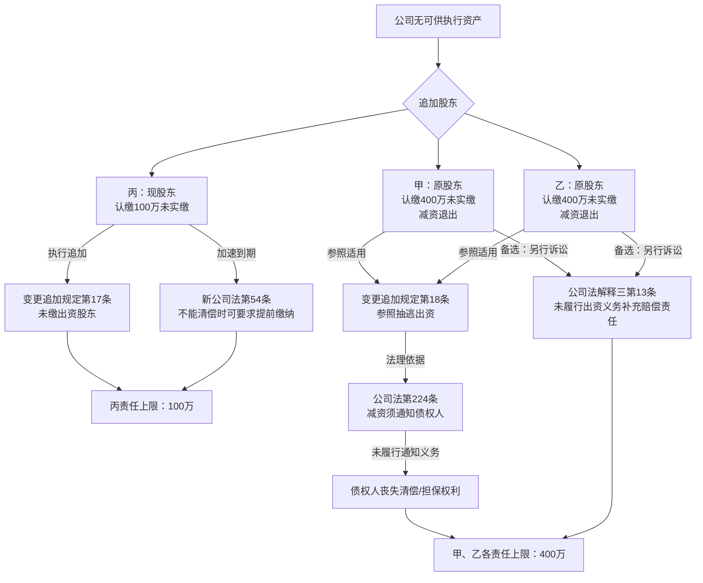

# 法律备忘录

**日期**：2026-04-12
**事由**：有限责任公司被执行人无财产可供执行，分析原股东甲、乙及现股东丙是否可被追加为被执行人

---

## 一、核心结论

| 股东 | 身份 | 结论 | 责任范围 | 追加路径 |
|------|------|------|---------|---------|
| **甲** | 原股东（已退出） | **可追加**，但存在不确定性 | 减资范围内（400万）承担补充赔偿责任 | 参照抽逃出资规则（变更追加规定第18条） |
| **乙** | 原股东（已退出） | **可追加**，但存在不确定性 | 减资范围内（400万）承担补充赔偿责任 | 参照抽逃出资规则（变更追加规定第18条） |
| **丙** | 现股东（仍在册） | **可追加**，路径清晰 | 认缴未缴部分（100万）承担补充赔偿责任 | 变更追加规定第17条 + 新公司法第54条 |

**重要提示**：三人承担的是**补充赔偿责任**，非连带责任；实际执行金额以公司债务不足清偿部分为限，不超过各自责任范围上限。

---

## 二、研究前提与适用范围

- **被执行人**：有限责任公司，经法院穷尽执行措施，无财产可供执行
- **股权结构（减资前）**：注册资本1000万，甲认缴400万、乙认缴400万、丙认缴200万，均未实缴
- **减资情况**：起诉前，公司减资至100万，甲、乙退出，仅丙留存；**减资未通知债权人**
- **债权形成时间**：早于减资
- **适用法律时间节点**：新《公司法》（2023修订）自2024年7月1日起施行

---

## 三、主要规则依据

### 1. 一般规则

**（1）追加未实缴股东为被执行人** `[元典API]`

《最高人民法院关于民事执行中变更、追加当事人若干问题的规定》（2020修正）**第十七条**（现行有效）：

> 作为被执行人的营利法人，财产不足以清偿生效法律文书确定的债务，申请执行人申请变更、追加**未缴纳或未足额缴纳出资的股东**、出资人或依公司法规定对该出资承担连带责任的发起人为被执行人，在尚未缴纳出资的范围内依法承担责任的，人民法院应予支持。

**（2）追加抽逃出资股东为被执行人** `[元典API]`

同规定**第十八条**（现行有效）：

> 作为被执行人的营利法人，财产不足以清偿生效法律文书确定的债务，申请执行人申请变更、追加**抽逃出资的股东**、出资人为被执行人，在抽逃出资的范围内承担责任的，人民法院应予支持。

**（3）追加未出资即转让股权的原股东** `[元典API]`

同规定**第十九条**（现行有效）：

> 作为被执行人的公司，财产不足以清偿生效法律文书确定的债务，其股东**未依法履行出资义务即转让股权**，申请执行人申请变更、追加该原股东或依公司法规定对该出资承担连带责任的发起人为被执行人，在未依法出资的范围内承担责任的，人民法院应予支持。

### 2. 特别规则

**（4）股东出资加速到期** `[元典API]`

《中华人民共和国公司法》（2023修订）**第五十四条**（2024年7月1日起施行）：

> 公司不能清偿到期债务的，公司或者已到期债权的债权人有权要求**已认缴出资但未届出资期限的股东提前缴纳出资**。

**（5）公司减资法定程序** `[元典API]`

《中华人民共和国公司法》（2023修订）**第二百二十四条**（现行有效）：

> 公司应当自股东会作出减少注册资本决议之日起十日内**通知债权人**，并于三十日内在报纸上或者国家企业信用信息公示系统公告。**债权人自接到通知之日起三十日内…有权要求公司清偿债务或者提供相应的担保。**

**（6）未履行出资义务的股东责任** `[元典API]`

《最高人民法院关于适用〈公司法〉若干问题的规定（三）》（2020修正）**第十三条第二款**（现行有效）：

> 公司债权人请求未履行或者未全面履行出资义务的股东在**未出资本息范围内**对公司债务不能清偿的部分承担**补充赔偿责任**的，人民法院应予支持。

---

## 四、分析

### 4.1 丙（现股东）——追加路径清晰

**事实**：丙为公司现有唯一股东，认缴100万，未实缴，公司无可供执行资产。

**法律适用**：

- **变更追加规定第17条**：丙属于"未缴纳出资的股东"，公司财产不足以清偿债务，申请执行人可直接申请追加丙为被执行人。`[元典API]`

- **新公司法第54条**：公司不能清偿到期债务，即使丙认缴期限未届满，债权人有权要求其**加速缴纳**。`[元典API]` 这是2024年新法的重要变化，无需等待认缴期限届满。

**责任范围**：丙在其**认缴未缴的100万元**范围内对公司债务不足清偿部分承担补充赔偿责任。

**结论**：**丙可被追加为被执行人，路径清晰，法律依据充分。**

---

### 4.2 甲、乙（原股东）——追加路径存在不确定性

**事实**：甲、乙各认缴400万，未实缴，通过**减资方式退出**（非股权转让），减资未通知债权人，债权形成于减资前。

#### 路径一：参照抽逃出资（变更追加规定第18条）

`[Tavily]` 司法实践中多数法院采此立场：公司减资未通知债权人，导致债权人丧失要求清偿或担保的权利，其实质与股东抽逃出资对债权人的损害相同，应参照适用《变更追加规定》第18条，在减资范围内追加为被执行人。（参见（2023）京03民终12527号）

`[AI分析]` 本路径的法理基础：

1. 减资前公司注册资本1000万（认缴），债权人信赖该资本规模与公司签约
2. 公司违法减资（未通知债权人），使债权人丧失《公司法》第224条赋予的保护权利
3. 参照抽逃出资规则，甲、乙在**减资金额范围内**（各400万认缴额）对公司债务承担补充赔偿责任

#### 路径二：变更追加规定第19条（未履行出资义务即转让股权）

第19条文义要件为"转让股权"，而甲、乙系通过减资退出，并非股权转让。`[AI分析]` 减资退出与股权转让在法律形式上不同，但实质效果相同（原股东退出、出资义务消灭）。部分法院支持扩张适用第19条，但存在被认定"超出条文文义"的风险。

**建议优先使用路径一（第18条参照适用）。**

#### 认缴减资的特殊争议

`[AI分析]` 甲、乙从未实缴，减资仅是削减了认缴额（账面义务），公司资产总量并未因此实际减少。部分法院（如上海法院）认为，若认缴期限未届满，减资前股东出资义务尚未生效，参照抽逃出资认定有失公平。

**反驳**：债权形成于减资前，债权人系信赖公司注册资本（1000万认缴）而与公司交易，减资后资本骤降至100万，减资前债权人应有权要求公司清偿或担保，公司未尽通知义务，实质上剥夺了债权人的这一权利，股东应承担相应责任。

**结论：甲、乙可被追加，但司法实践中存在一定不确定性，建议同时提起诉讼（公司法解释三第13条路径）作为备选。**

---

### 4.3 诉讼路径与执行追加路径的选择

`[AI分析]`

| 路径 | 方式 | 优点 | 缺点 |
|------|------|------|------|
| 执行追加（变更追加规定） | 在执行程序中申请追加 | 快捷，无需重新起诉 | 法院审查严格，减资追加存在不确定性 |
| 另行起诉（公司法解释三第13条） | 对甲、乙、丙单独提起诉讼 | 通过实体审理，成功率更高 | 需要重新立案，耗时较长 |

**建议**：对丙优先走执行追加；对甲、乙可同时提起执行追加和另行诉讼两条路径，提高胜算。

---

## 五、实务观点

**云亭律所** `[Tavily]`：公司减资未通知债权人，司法实践主流立场是参照适用抽逃出资的规定。原因在于公司注册资本减少意味着公司责任财产减少，与抽逃出资对债权人影响的实质相同。

**中伦律所** `[Tavily]`：变更追加规定第17条适用于出资期限已届满的情形，未届期限的需借助加速到期规则，且加速到期通常需通过诉讼程序进行实体审理，不能直接在执行程序中追加。（注：新《公司法》第54条出台后，此问题有所改善）

**（2025）辽0203执异24号** `[元典API]`：申请执行人依据《公司法》第224条、《公司法解释三》第13条、变更追加规定第18条、第19条申请追加减资未通知债权人的股东为被执行人，法院予以受理审查。

---

## 六、风险与不确定性

1. **认缴期限未届满的争议**：若甲、乙认缴期限未到，部分法院可能以"期限利益保护"为由，不支持在执行程序中追加甲、乙，需通过诉讼程序主张出资加速到期。

2. **减资是否等同于抽逃出资**：各地法院裁判不一，部分法院认为减资不等于抽逃出资，不适用第18条，须另寻诉讼途径。

3. **甲、乙退出后已无股东身份**：第17条文义针对"现股东"，对已退出原股东适用第17条存在障碍，须走第18条或第19条路径。

4. **责任范围上限**：甲、乙各最高400万，丙最高100万，且三者责任均为补充赔偿责任（非连带），不得超过公司实际不能清偿的债务金额。

5. **新公司法溯及力**：债权及减资行为均发生在2024年7月1日新公司法施行前，加速到期条款（第54条）是否溯及适用存在争议，但主流观点认为新法施行后的执行程序应适用新法。

---

## 七、结论与实务建议

**甲、乙**：建议通过两条路径并行推进——
1. 在执行程序中，依据《变更追加规定》第18条（参照抽逃出资）申请追加；
2. 同时另行提起诉讼，依据《公司法解释三》第13条，主张甲、乙在各自减资金额（400万）范围内对公司债务不足清偿部分承担补充赔偿责任；

**丙**：路径清晰，直接依据《变更追加规定》第17条申请追加，同时援引新《公司法》第54条出资加速到期规则；责任上限为认缴未缴的100万元。

**整体策略**：优先在执行程序中追加丙（最稳妥），对甲、乙走诉讼路径确认责任，再申请执行。

---

## 八、主要法规依据清单

**一手权威资料（法律文件）**：

〔1〕《最高人民法院关于民事执行中变更、追加当事人若干问题的规定》（2020修正）第十七条、第十八条、第十九条，现行有效，2021年1月1日起施行。

〔2〕《中华人民共和国公司法》（2023修订），国家主席令第15号，第五十四条（出资加速到期）、第二百二十四条（减资程序），自2024年7月1日起施行。

〔3〕《最高人民法院关于适用〈中华人民共和国公司法〉若干问题的规定（三）》（2020修正）第十三条第二款，现行有效，2021年1月1日起施行。

**一手权威资料（司法案例）**：

〔4〕张某与XX公司劳动争议追加被执行人案，大连市西岗区人民法院（2025）辽0203执异24号（申请追加减资未通知债权人股东，法院受理审查）。

〔5〕庞爱丽与商贸公司执行异议案，北京市第三中级人民法院（2023）京03民终12527号（减资未通知债权人，参照抽逃出资追加被执行人）。

**二手参考资料**：

〔6〕云亭律师事务所：《未通知债权人违法减资，股东如何承担责任》，载云亭法评，http://www.yuntinglaw.com/news/show-274.html。

〔7〕中伦律师事务所：《新公司法实施后能否追加违法减资的股东为被执行人》，载中伦律师事务所官网。

---

## 九、关键资料溯引图

