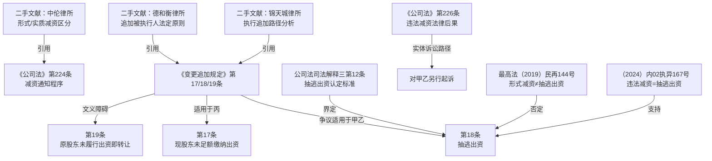

# 法律备忘录

**日期**：2026-04-13  
**收件人**：内部研究使用  
**发件人**：  
**事由**：有限责任公司股东（含减资退出的原股东）在公司无可供执行资产情形下能否被追加为被执行人

---

## 一、核心结论

| 股东 | 原认缴 | 实缴 | 减资后状态 | 追加依据 | 结论 |
|------|--------|------|------------|----------|------|
| **甲** | 400万 | 0 | 减资退出（不再是股东） | 《变更追加规定》第19条（类推适用争议较大）；或违法减资→第18条（裁判分歧） | **较强观点**：可追加（如减资违法且有资金流出）；**较稳妥观点**：需另行诉讼 |
| **乙** | 400万 | 0 | 减资退出（不再是股东） | 同上 | 同甲 |
| **丙** | 200万→100万 | 0 | 仍为股东（100万认缴未实缴） | 《变更追加规定》第17条 | **可以追加**，在未缴纳100万元范围内承担责任 |

**核心要点**：
- **丙**（现股东，未实缴）：追加依据明确，法律适用无争议，可直接申请追加。
- **甲、乙**（减资退出的原股东）：追加存在法律路径，但裁判尺度有明显分歧，结果存在不确定性——**减资是否违法**及**是否有资金实际流出**是核心判断因素。

---

## 二、研究前提与适用范围

1. **主体性质**：被执行人为有限责任公司（非一人有限责任公司、非国有企业，适用一般有限责任公司规则）。
2. **时间适用法律**：减资发生于起诉前。本案起诉时间未明确，公司减资登记完成时间影响应适用旧《公司法》（2018修正）还是新《公司法》（2023修订，2024年7月1日施行）的具体条款判断，本文以新《公司法》为主要依据。
3. **执行程序前提**：公司已无可供执行财产，执行已终本（符合追加被执行人的前提条件）。
4. **未查明事实**：
   - 减资时公司是否依法通知债权人（该事实将直接影响是否构成"违法减资"）。
   - 甲、乙减资退出时，是否有资金实际返还给甲、乙（影响是否构成"实质减资"）。
   - 起诉的债权是否形成于减资之前。

---

## 三、主要规则依据

### 1. 一般规则

**执行追加的法定主义原则**

> 追加被执行人应严格遵循法定原则，执行程序中只能依据明确的法定情形追加，不得以执代审。

依据：《最高人民法院关于民事执行中变更、追加当事人若干问题的规定（2020修正）》第1条、第32条（法释〔2020〕21号，现行有效）。

**有限责任公司股东的有限责任原则**

> 有限责任公司的股东以其认缴的出资额为限对公司承担责任。

依据：《中华人民共和国公司法（2023修订）》第3条（2024年7月1日施行，现行有效）。

### 2. 特别规则

**（1）现股东未足额缴纳出资——第17条**

> 作为被执行人的营利法人，财产不足以清偿生效法律文书确定的债务，申请执行人申请变更、追加**未缴纳或未足额缴纳出资的股东**、出资人……为被执行人，在尚未缴纳出资的范围内依法承担责任的，人民法院应予支持。

依据：《最高人民法院关于民事执行中变更、追加当事人若干问题的规定（2020修正）》第17条（现行有效）。

**（2）抽逃出资股东——第18条**

> 作为被执行人的营利法人，财产不足以清偿生效法律文书确定的债务，申请执行人申请变更、追加**抽逃出资的股东**、出资人为被执行人，在抽逃出资的范围内承担责任的，人民法院应予支持。

依据：《最高人民法院关于民事执行中变更、追加当事人若干问题的规定（2020修正）》第18条（现行有效）。

"抽逃出资"的认定标准（包括兜底条款"其他未经法定程序将出资抽回的行为"）：
依据：《最高人民法院关于适用〈中华人民共和国公司法〉若干问题的规定（三）（2020修正）》第12条（现行有效）。

**（3）原股东未依法履行出资义务即转让股权——第19条**

> 作为被执行人的公司，财产不足以清偿生效法律文书确定的债务，其股东**未依法履行出资义务即转让股权**，申请执行人申请变更、追加该原股东……为被执行人，在未依法出资的范围内承担责任的，人民法院应予支持。

依据：《最高人民法院关于民事执行中变更、追加当事人若干问题的规定（2020修正）》第19条（现行有效）。

**（4）违法减资的法定后果**

> 违反本法规定减少注册资本的，股东应当退还其收到的资金，减免股东出资的应当恢复原状；给公司造成损失的，股东及负有责任的董事、监事、高级管理人员应当承担赔偿责任。

依据：《中华人民共和国公司法（2023修订）》第226条（现行有效）。

减资程序要求（通知债权人义务）：
依据：《中华人民共和国公司法（2023修订）》第224条（现行有效）。

**（5）出资加速到期（实体法路径）**

> 公司不能清偿到期债务的，公司或者**已到期债权的债权人**有权要求已认缴出资但未届出资期限的股东提前缴纳出资。

依据：《中华人民共和国公司法（2023修订）》第54条（现行有效）。

---

## 四、分析

### 4.1 丙（现股东）——适用第17条，可直接追加

**事实前提**：丙减资后认缴100万元，仍为公司股东，实缴金额为0。

**法律问题**：丙是否属于"未缴纳或未足额缴纳出资的股东"？

**适用规则**：《变更追加规定》第17条。

**规则解释**：该条文义清晰，适用要件为：①被执行人为营利法人，②财产不足以清偿债务，③申请执行人申请追加，④追加对象为"未缴纳或未足额缴纳出资的股东"。丙作为现股东，认缴100万元，实缴0元，完全符合"未足额缴纳出资"的认定标准。

**对事实的适用**：丙认缴100万元，实缴0元，责任范围为**100万元**（在未缴纳出资范围内）。

**初步结论**：丙可被追加为被执行人，在100万元范围内承担责任。此路径适用法条明确，无重大法律争议。

> **注意**：丙的原认缴额为200万元，减资后降至100万元。如减资程序合法（依法通知了债权人），则丙仅以减资后的认缴额（100万元）为限承担责任；如减资违法（未通知债权人），且债权产生于减资前，则丙可能在更大范围内承担责任（见4.2对甲乙的分析）。

---

### 4.2 甲、乙（减资退出的原股东）——路径存在法律争议

**事实前提**：甲认缴400万元、乙认缴400万元，均实缴0元，通过公司减资方式退出，减资后不再是公司股东。债权产生于减资前（起诉前减资）。

**法律问题**：减资退出的原股东是否可被追加为被执行人？依据何种条款？

#### 路径一：类推适用第19条（"未依法履行出资义务即转让股权"）

第19条文义为"转让股权"，而甲乙系"减资退出"，二者均导致股东未实缴出资而退出公司的结果。

法律解释分析：
- **文义解释**：第19条明确规定"转让股权"，减资退出并非股权转让，不在文义射程内。
- **体系解释**：《变更追加规定》对追加被执行人采严格法定主义，第14至24条是封闭性列举，不得扩张适用。
- **客观目的解释**：第19条的立法目的是防止股东以"出走"方式逃避出资义务，减资退出与股权转让在结果上同等危害债权人利益。部分法院支持类推，但司法实践中多数法院认为不得突破文义扩张适用。

**结论**：适用第19条的文义路径存在障碍，但部分法院以目的解释支持追加，不稳定。

#### 路径二：违法减资构成抽逃出资——适用第18条

这是实践中讨论最多的路径。核心问题：减资违法（未通知债权人）是否构成"其他未经法定程序将出资抽回的行为"（公司法解释三第12条第4项兜底条款）？

裁判实践中存在**明显分歧**：

**支持追加的观点（实质减资说）**：
- （2024）内02执异167号：认为公司未通知债权人即减资，其行为构成抽逃出资，追加股东为被执行人。
- （2023）京03民终12527号（北京市三中院）：认为违法减资符合抽逃出资的"其他未经法定程序将出资抽回"，可按第18条追加。
- 适用前提：**减资后有资金实际流出**（即实质减资，非形式减资）。

**反对追加的观点（法定主义说）**：
- （2025）赣0313执异28号：区分形式减资和实质减资，认为认缴制下形式减资（注册资本减少但净资产不变，无资金流出）不构成抽逃出资，不应按第18条追加。
- （2023）粤06民终6938号：明确认为违法减资不属于第18条法定追加事由，申请人应另行诉讼。
- （2019）最高法民再144号：最高院认为减资行为是否合法不属于执行程序审查范围，形式减资不导致公司财产减少，不得追加。

**判断关键**：
- 若甲乙减资退出时，有资金实际返还给甲乙（**实质减资**），则构成抽逃出资，追加的可能性更高；
- 若甲乙退出时未收到任何资金（公司本无净资产，属**形式减资**），则多数法院认为不构成抽逃出资，执行追加难度大。

本案中，公司注册资本1000万元，股东均未实缴，公司可能自始即无净资产，减资更可能属于**形式减资**。此时，甲乙通过执行程序直接追加的难度较大。

#### 路径三：实体法诉讼（非执行追加）

无论追加是否成立，申请执行人均可另行对甲、乙提起诉讼：
- 依据《公司法》第226条（违法减资后果），要求甲乙退还减免的出资或恢复原状；
- 依据《公司法司法解释三》第13条第2款，以甲乙"未全面履行出资义务"要求其在未出资本息范围内对公司债务承担补充赔偿责任。

此路径绕开执行追加的程序争议，直接以实体权利追诉，法律依据更为稳定，但需额外提起诉讼。

---

## 五、实务观点

1. **中伦律师事务所**（《区分"形式减资"与"实质减资"在有限责任公司减资问题实务上的理解与实践》）：区分实质减资和形式减资，认为只有实质减资（有净资产流向股东）才应受到债权人保护程序的严格限制，形式减资并不导致公司净资产减少，对债权人偿债能力的影响有限。参见：https://www.zhonglun.com/research/articles/9330.html

2. **德和衡律师事务所**（《新公司法适用前，执行追加多重转让未届出资期限股东的规则、分歧与债权人困境》）：指出执行程序追加被执行人应严格遵循法定原则，最高法院在（2023）最高法民申567号中明确追加被执行人不能直接依据《公司法》及解释主张，只能依据《变更追加规定》列举的法定情形。参见：https://www.deheheng.com/content/35392.html

3. **锦天城律师事务所**（《执行程序中可否直接追加未届出资期限的股东为被执行人》）：梳理了执行程序追加的严格限制，以及在《九民纪要》第6条框架下出资加速到期的诉讼路径，认为两条路径各有适用场景。参见：https://www.allbrightlaw.com/CN/10475/e8c559cb27300f61.aspx

---

## 六、风险与不确定性

1. **甲乙追加的不确定性**：违法减资能否适用第18条（抽逃出资），裁判尺度存在明显分歧，结果取决于：（a）减资是否违法（是否依法通知债权人）；（b）减资时是否有资金实际流出。若为形式减资，多数法院不支持执行追加。

2. **新旧公司法衔接问题**：本案减资发生于起诉前，需核查具体减资登记时间，确认适用旧《公司法》（2018修正）第177条还是新《公司法》第224条，条文要求实质相同，但新公司法第226条关于违法减资后果的规定更为明确。

3. **丙100万认缴额减资后的效力**：若丙参与的减资程序违法（未通知债权人，且债权形成于减资前），债权人可主张该减资对其不生效，要求丙仍按原200万元出资额承担责任。需结合实际减资程序合法性进一步判断。

4. **执行追加的程序要求**：依据《变更追加规定》第32条，针对第17条至第21条的追加裁定，被申请人可在裁定送达后15日内提起执行异议之诉，追加效力存在被撤销的风险。

5. **出资加速到期与入库规则**：若通过诉讼要求出资加速到期，需注意裁判实践中的"入库规则"——股东应将出资缴入公司，而非直接向单个债权人清偿，以保护其他债权人的公平受偿权。

---

## 七、结论与实务建议

**结论**：
- **丙**：可直接向执行法院申请追加为被执行人，依据《变更追加规定》第17条，责任范围为其未缴纳出资额（100万元）。
- **甲、乙**：执行程序直接追加存在较大不确定性，建议评估减资性质后择路而行：
  - 若减资违法且有资金流出（实质减资）：可申请追加，同时准备应对执行异议之诉；
  - 若减资为形式减资（无资金流出）：直接追加成功率低，建议另行提起诉讼。

**实务建议**：

1. **立即启动对丙的追加程序**：向执行法院提交书面申请，附公司工商档案（证明丙仍为股东，认缴100万元未实缴），依据第17条申请追加，同时要求丙在100万元范围内承担责任。

2. **调查甲乙减资时的资金流向**：申请调取公司工商减资档案，确认减资程序是否依法通知债权人，以及减资时是否有资金实际支付给甲乙。

3. **对甲乙分两步走**：
   - 第一步：视减资性质，向执行法院申请追加（依据第18条），以违法减资构成抽逃出资为由；
   - 第二步（无论追加是否成立）：另行对甲乙提起诉讼，依据《公司法》第226条要求退还出资或恢复原状，同时依据《公司法司法解释三》第13条第2款要求其在未出资范围内对公司债务不能清偿部分承担补充赔偿责任。

4. **关注债权形成时间**：如债权形成于减资之前，甲乙的减资行为对申请执行人不生效的主张更具说服力。

---

## 八、主要法规依据清单

**一手权威资料（法律文件）**：

〔1〕《最高人民法院关于民事执行中变更、追加当事人若干问题的规定（2020修正）》，法释〔2020〕21号，2020年12月29日发布，2021年1月1日施行，现行有效。第17条、第18条、第19条、第32条。（经元典API核实）

〔2〕《中华人民共和国公司法（2023修订）》，2023年12月29日发布，2024年7月1日施行，现行有效。第3条、第54条、第88条、第224条、第225条、第226条。（经元典API核实）

〔3〕《最高人民法院关于适用〈中华人民共和国公司法〉若干问题的规定（三）（2020修正）》，2020年12月29日发布，现行有效。第12条（抽逃出资的认定）、第13条第2款（股东补充赔偿责任）、第18条（未履行出资义务转让股权）。（经元典API核实）

**一手权威资料（司法案例）**：

〔4〕（2020）最高法民申5153号裁定：确认中外合作企业股东未履行增资义务即转让股权，转让后仍应对增资义务承担责任，可被追加为被执行人。（权威案例，元典API检索）

〔5〕（2024）内02执异167号：认定公司违法减资（仅登报未通知债权人）构成股东抽逃出资，依据第18条追加股东为被执行人。（元典API检索）

〔6〕（2025）赣0313执异28号：区分形式减资和实质减资，认为认缴制下形式减资（无资金流出）不构成抽逃出资，不能适用第18条追加。（元典API检索）

〔7〕（2023）粤06民终6938号：明确违法减资不属于《变更追加规定》法定追加事由，申请人可另循法律途径解决。（元典API检索）

**二手参考资料**：

〔8〕中伦律师事务所：《区分"形式减资"与"实质减资"在有限责任公司减资问题实务上的理解与实践》，https://www.zhonglun.com/research/articles/9330.html

〔9〕德和衡律师事务所·杨光明、许惠茹：《新公司法适用前，执行追加多重转让未届出资期限股东的规则、分歧与债权人困境》，https://www.deheheng.com/content/35392.html

〔10〕锦天城律师事务所：《执行程序中可否直接追加未届出资期限的股东为被执行人——以〈九民纪要〉第6条第1款为视角》，https://www.allbrightlaw.com/CN/10475/e8c559cb27300f61.aspx

---

## 九、关键资料溯引图

---

*本备忘录仅供内部研究参考，不构成正式法律意见。建议在作出实务决策前咨询执业律师。*
