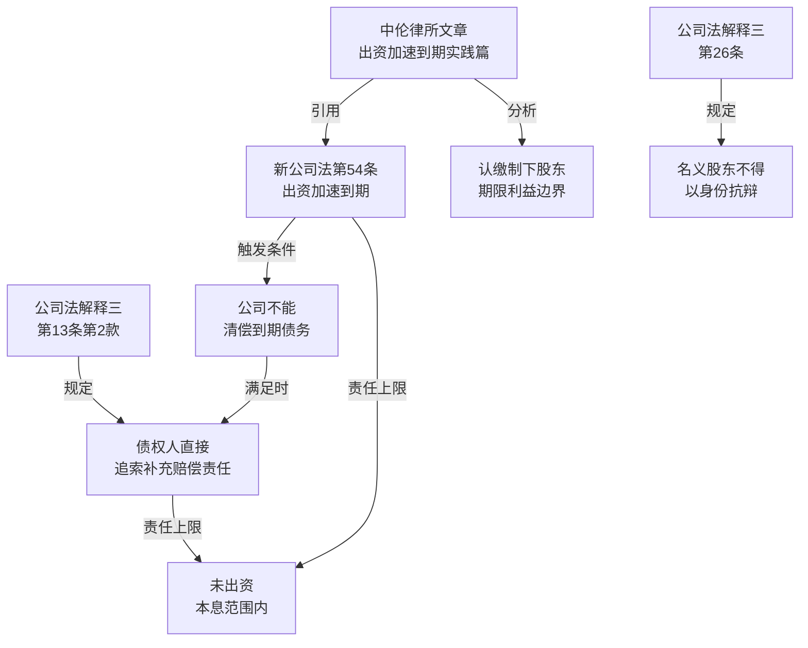

# 法律备忘录

**日期**：2026-04-12
**收件人**：内部研究使用
**发件人**：
**事由**：公司股东未实缴出资时，债权人能否追索股东责任分析

---

## 一、核心结论

| 情形 | 结论 | 责任范围 | 法律路径 |
|------|------|---------|---------|
| 认缴期限**已届满**未实缴 | **可直接追索** | 未出资本息范围内承担补充赔偿责任 | 公司法解释三第13条 |
| 认缴期限**未届满**未实缴 | **可通过加速到期追索** | 同上 | 新公司法第54条 |
| 名义股东（代实际出资人持股） | **名义股东须承担**，后可向实际出资人追偿 | 未出资本息范围 | 公司法解释三第26条 |

**责任性质**：均为**补充赔偿责任**，非连带责任——以公司实际不能清偿部分为限，不超过未实缴出资本息总额。

---

## 二、研究前提与适用范围

- **主体**：有限责任公司股东（认缴制下）
- **前提**：公司无法清偿到期债务（债权人须证明：债权债务关系成立、履行期届满、债务未清偿）
- **法域**：中华人民共和国境内
- **时间**：以现行有效法规为准（截至2026年4月），核心依据为2024年7月1日施行的新《公司法》
- **不含**：破产清算场景下的出资追缴（另有《企业破产法》适用）

---

## 三、主要规则依据

### 1. 一般规则

**（1）未履行出资义务股东的补充赔偿责任** `[元典API]`

《最高人民法院关于适用〈中华人民共和国公司法〉若干问题的规定（三）》（2020修正）**第十三条第二款**（现行有效）：

> 公司债权人请求未履行或者未全面履行出资义务的股东在**未出资本息范围内**对公司债务不能清偿的部分承担**补充赔偿责任**的，人民法院应予支持；未履行或者未全面履行出资义务的股东已经承担上述责任，其他债权人提出相同请求的，人民法院不予支持。

**（2）名义股东的连带责任** `[元典API]`

同规定**第二十六条**（现行有效）：

> 公司债权人以登记于公司登记机关的股东未履行出资义务为由，请求其对公司债务不能清偿的部分在未出资本息范围内承担补充赔偿责任，股东以其仅为名义股东而非实际出资人为由进行抗辩的，人民法院不予支持。

### 2. 特别规则

**（3）认缴期限未届满时的出资加速到期** `[元典API]`

《中华人民共和国公司法》（2023修订）**第五十四条**（2024年7月1日起施行，现行有效）：

> 公司不能清偿到期债务的，公司或者**已到期债权的债权人**有权要求已认缴出资但未届出资期限的股东提前缴纳出资。

---

## 四、分析

### 4.1 认缴期限已届满的情形

**事实前提**：股东认缴出资期限已到，但未实缴；公司无法清偿债权人到期债务。

**法律适用**：公司法解释三第13条第二款直接适用，债权人无需经公司同意，可直接起诉股东，要求其在未出资本息范围内承担补充赔偿责任。

**举证分配** `[AI分析]`：债权人仅需证明三点（中伦律所文章引用最高院立场）：①债权债务关系依法成立；②履行期届满；③公司未完全清偿。股东未实缴的事实可从工商登记系统的实缴信息取证。

### 4.2 认缴期限未届满的情形（出资加速到期）

**事实前提**：股东认缴期限尚未届满，但公司已不能清偿到期债务。

**法律适用**：新《公司法》第54条确立"概括性"加速到期制度，打破了此前需依赖破产程序或九民纪要严格条件的限制。满足"公司不能清偿到期债务"即可触发，无需等到认缴期届满。

**程序路径** `[AI分析]`：司法实践中存在两条路径：
1. 在执行程序中申请追加（依据公司法第54条）——效率更高
2. 另行提起实体诉讼——成功率更稳定

法院裁判已确认（（2023）粤0112民初5925号）：公司被法院穷尽执行措施仍无财产可供执行，即可认定符合"不能清偿到期债务"。

### 4.3 责任边界

- **责任上限**：各股东仅在其"未出资本息"范围内承担，不超过该额度
- **补充性**：须以公司财产无法清偿为前提；公司有财产时，不能直接追索股东
- **一次性消灭**：股东承担补充赔偿责任后，其他债权人就同一债务不得重复追索（解释三第13条）

---

## 五、实务观点

**中伦律师事务所** `[Tavily]`：新《公司法》第54条标志着我国正式确立"非破产、解散"情形下的概括性股东出资加速到期制度，债权人只需证明"公司不能清偿到期债务"即可触发，门槛低于以往。但权利性质、适用条件、法律效果的认定仍有模糊之处。

**锦天城律师事务所** `[Tavily]`：股东在履行"补充赔偿责任"后，应及时保存书面证据并向公司办理实缴出资手续，防止被多个债权人重复追缴。

---

## 六、风险与不确定性

1. **"不能清偿"的认定标准**：各地法院对"不能清偿到期债务"的认定尺度不一。部分法院要求债权人先取得胜诉判决并申请执行，获得终本裁定后方可认定；另一些法院允许在实体诉讼中直接认定。

2. **加速到期的溯及力**：新公司法2024年7月1日施行后，对之前已认缴的股份是否适用第54条，实践中存在争议，但主流观点认为新法施行后的诉讼程序适用新法。

3. **多债权人竞合**：公司有多个债权人时，先行追索的债权人若已令股东承担了责任，后续债权人就同一股东的同一未出资额无法再次追索（解释三第13条限制）——债权人应注意及时行权。

4. **认缴期过长的操纵风险** `[AI分析]`：股东可能恶意设置超长认缴期限规避责任，新公司法已有限制（五年内认缴要求），但对过渡期安排仍有争议。

---

## 七、结论与实务建议

**结论**：债权人在公司无法清偿债务时，**可以**追索未实缴出资的股东：期限已届满者依公司法解释三第13条直接追索；期限未届满者依新公司法第54条主张加速到期，均可要求股东在未出资本息范围内承担补充赔偿责任。

**实务建议**：
- 优先收集公司工商登记信息，确认股东实缴情况
- 取得公司不能清偿的证据（终本执行裁定书效力最强）
- 对认缴期届满股东走执行追加程序（效率最高）；对认缴期未届满股东另行提起出资加速到期诉讼
- 注意抢先行权，避免被其他债权人抢占追索额度

---

## 八、主要法规依据清单

**一手权威资料（法律文件）**：

〔1〕《最高人民法院关于适用〈中华人民共和国公司法〉若干问题的规定（三）》（2020修正），第十三条第二款、第二十六条，现行有效，2021年1月1日起施行。

〔2〕《中华人民共和国公司法》（2023修订），国家主席令第15号，第五十四条（股东出资加速到期），自2024年7月1日起施行，现行有效。

**一手权威资料（司法案例）**：

〔3〕广州喜安装饰工程有限公司等合同纠纷案，广州市黄埔区人民法院（2023）粤0112民初5925号民事判决书（认定公司终本执行构成"不能清偿到期债务"，支持出资加速到期）。

**二手参考资料**：

〔4〕中伦律师事务所：《新《公司法》下：关于股东出资加速到期制度的债权追索适用规则（实践篇）》，载中伦律师事务所官网，https://www.zhonglun.com/research/articles/54621.html。

〔5〕上海市锦天城律师事务所：《试论股东补充赔偿责任履行后出资义务豁免的司法认定与实务路径》，载锦天城律师事务所官网，https://www.allbrightlaw.com/CN/10475/e9f9a01181d86652.aspx。

---

## 九、关键资料溯引图

---

## 工具使用报告

**元典 API**：
- `search_fatiao`：2次（检索"股东出资加速到期"、"未履行出资义务补充赔偿责任"）
- `get_fatiao_detail`：2次（验证公司法第54条、公司法解释三第13条原文）
- `search_ptal`：1次（检索相关裁判文书，共返回9408条，取5条）

**Tavily**：
- `search_lawfirm_articles`：1次（检索律所文章，返回5条）
- `search_government_interpretations`：1次（检索政府解读，返回3条）
- `search_secondary_sources`：1次（综合检索，返回5条）
