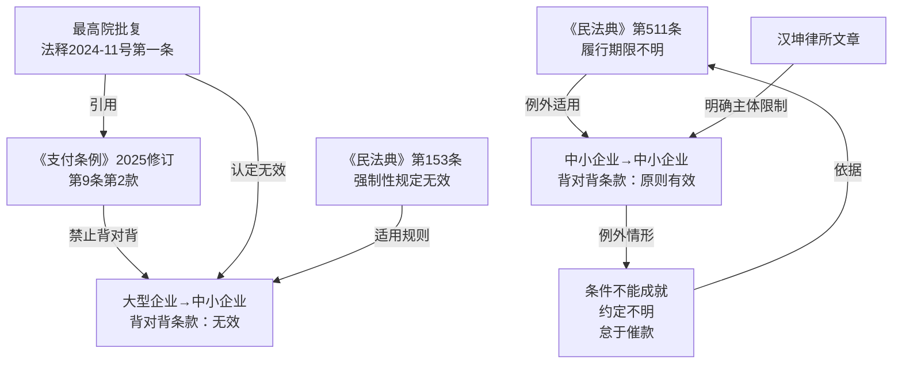

# 法律备忘录

**日期**：2026-04-12
**收件人**：内部研究使用
**发件人**：
**事由**：中小企业（总包方）与中小企业（分包方）约定背对背付款条款的法律效力及风险分析

---

## 一、核心结论

| 合同主体 | 背对背条款效力 | 法律依据 |
|---------|------------|---------|
| **大型企业** → 中小企业 | **无效** | 《支付条例》第9条 + 最高院批复（法释〔2024〕11号） |
| **中小企业** → 中小企业 | **原则有效**，但存在可被突破的例外情形 | 无明文禁止；民法典合同自由原则 |

**重要提示**：你们双方均为中小企业时，背对背条款当前无明确强制性禁止规定，原则上有效。但以下情形下法院可能不支持该条款：付款条件确定不能成就、条款约定不明、总包方怠于催款。

---

## 二、研究前提与适用范围

- **主体**：总包方（中小企业）+ 分包方（中小企业），均符合《中小企业划型标准规定》
- **合同类型**：建设工程施工分包合同
- **条款内容**："收到业主付款后再向分包方付款"
- **法域**：中华人民共和国境内
- **时间**：以现行有效法规为准（截至2026年4月）

---

## 三、主要规则依据

### 1. 一般规则

**（1）合同自由原则** `[元典API]`

《中华人民共和国民法典》第一百五十三条（现行有效）：

> 违反法律、行政法规的强制性规定的民事法律行为无效。但是，该强制性规定不导致该民事法律行为无效的除外。

背对背条款本质是附条件的付款约定，在无强制性禁止规定时，依合同自由原则有效。

### 2. 特别规则

**（2）大型企业对中小企业的强制性禁止** `[元典API]`

《保障中小企业款项支付条例》（2025修订）**第九条第二款**（现行有效，2025年6月1日起施行）：

> 大型企业从中小企业采购货物、工程、服务，……**不得约定以收到第三方付款作为向中小企业支付款项的条件**或者按照第三方付款进度比例支付中小企业款项。

**（3）最高院批复明确无效** `[元典API]`

《最高人民法院关于大型企业与中小企业约定以第三方支付款项为付款前提条款效力问题的批复》（法释〔2024〕11号，2024年8月27日起施行）**第一条**（现行有效）：

> **大型企业**在建设工程施工、采购货物或者服务过程中，与中小企业约定以收到第三方向其支付的款项为付款前提的，……人民法院应当根据民法典第一百五十三条第一款的规定，**认定该约定条款无效**。

**适用主体限定**：批复明确限于"大型企业与中小企业之间"，中小企业之间不在此列。

---

## 四、分析

### 4.1 中小企业之间是否受现行法规禁止？

**结论：不在强制性禁止范围内。**

对比各规范文件的义务主体：

| 规范 | 义务主体 | 是否禁止背对背 |
|------|---------|------------|
| 《支付条例》第7、9条 | 机关、事业单位、**大型企业** | 是 |
| 最高院批复 | **大型企业** | 是 |
| 《民营经济促进法》第68条 | **大型企业** | 是 |
| 中小企业对中小企业 | 中小企业 | **无明文禁止** |

立法目的在于防止大型企业利用优势地位转嫁付款风险。两个中小企业之间，法律预设不存在明显强弱之分，故未纳入强制规制范围。`[AI分析]`

### 4.2 中小企业间背对背条款的可突破情形

即便条款原则有效，以下情形下法院可能排除适用：

1. **付款条件确定不能成就** `[AI分析]`：业主已明确拒绝付款、进入破产程序或工程竣工多年无望收款，法院可依民法典总则编司法解释认定条件"不可能发生"，突破背对背条款。

2. **约定不明**：条款措辞模糊（如"参考业主回款比例支付"），法院可能认定为"履行期限不明"，允许分包方随时要求付款（民法典第511条）。

3. **总包方怠于催款**：若总包方未积极向业主催款，可能被法院认定怠于行使权利，削弱抗辩效力。

4. **付款条件已成就**：业主已向总包方支付对应款项，总包方无正当理由拒付。

### 4.3 主体认定的重要性

**注意**：条款效力以合同订立时的企业规模认定为准。若总包方实际属于大型企业（即使自认为中小企业），背对背条款依法无效。建议合同签署前核查双方工商注册信息及规模类型。`[AI分析]`

---

## 五、实务观点

**中伦律师事务所** `[Tavily]`：批复第一条明确，适用范围限于"大型企业与中小企业之间"，中小企业对中小企业之间的背对背条款在批复规制范围之外。

**汉坤律师事务所** `[Tavily]`：最高院批复"只开了一个很小的切口"，不在批复规制范围的中小企业间背对背条款，效力认定仍沿用传统合同自由原则。

**君合律师事务所** `[Tavily]`：《支付条例》2025修订版第九条第二款的禁止对象明确为"大型企业"，未扩展至中小企业作为付款方的情形。

---

## 六、风险与不确定性

1. **大型企业认定风险**：若总包方实际属于大型企业，条款无效。需按《中小企业划型标准规定》核实。
2. **条款措辞风险**：措辞模糊有被认定为"约定不明"的风险。
3. **催款义务风险**：总包方未积极催款，可能被法院削弱抗辩效力。
4. **条件不能成就风险**：业主陷入困境时，法院可能认定条件确定不能成就。
5. **立法趋势风险**：近年立法持续向保护小微企业倾斜，不排除未来将禁止范围扩展至中小企业之间。

---

## 七、结论与实务建议

**结论**：双方均为中小企业时，背对背条款当前原则有效，但并非绝对，存在可被突破的情形。

**对总包方**：
- 确认自身为中小企业（非大型企业）
- 条款措辞精确，明确付款触发条件（"收到业主该部分工程款后N日内支付"）
- 书面留存向业主催款记录，证明尽到积极催收义务
- 约定业主违约/无力付款时的应急付款安排

**对分包方**：
- 争取设定最长等待期限（"业主付款后30日内，或自工程竣工验收后X月内，取较早者"）
- 若业主已向总包付款，及时主张条件已成就
- 超过合理期限可主张条件不能成就或约定不明，要求直接付款

---

## 八、主要法规依据清单

**一手权威资料（法律文件）**：

〔1〕《中华人民共和国民法典》第一百五十三条（现行有效，2021年1月1日起施行）。

〔2〕《保障中小企业款项支付条例》（国令第802号，2025年修订版），第九条第二款，自2025年6月1日起施行，现行有效。

〔3〕《最高人民法院关于大型企业与中小企业约定以第三方支付款项为付款前提条款效力问题的批复》，法释〔2024〕11号，自2024年8月27日起施行，第一条，现行有效。

**二手参考资料**：

〔4〕中伦律师事务所：《企业账款清理新情态下"背靠背"条款设计及争议攻防策略》，载中伦律师事务所官网，https://www.zhonglun.com/research/articles/53803.html。

〔5〕汉坤律师事务所：《最高院批复背景下"背靠背"条款效力的研究》，载汉坤律师事务所官网，https://hankunlaw.com/portal/article/index/cid/8/id/14619.html。

〔6〕君合律师事务所：《〈保障中小企业款项支付条例〉修订要点解读及实务法律问题研究》，载君合律师事务所官网，https://junhe.com/law-reviews/2679。

---

## 九、关键资料溯引图

---

## 工具使用报告

**元典 API**：
- `get_fatiao_detail`：3次（《支付条例》第9条、最高院批复第一条、《民法典》第153条）
- `search_fatiao`：1次（检索"大型企业 中小企业 第三方支付款项 无效"）

**Tavily**：
- `search_lawfirm_articles`：1次（检索背靠背条款效力，返回5条）
- `search_secondary_sources`：1次（综合检索，返回5条）
