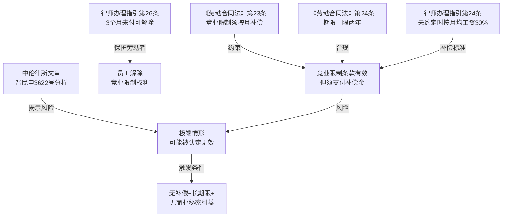

# 法律备忘录

**日期**：2026-04-12
**收件人**：内部研究使用
**发件人**：
**事由**：劳动合同约定竞业限制但未约定补偿金的效力及法律后果分析

---

## 一、核心结论

| 问题 | 结论 |
|------|------|
| 竞业限制条款是否有效？ | **有效**——未约定补偿金不影响条款本身效力 |
| 公司能要求员工履行竞业限制义务吗？ | **能**，但须同步支付补偿金（按月平均工资30%） |
| 员工能拒绝履行竞业限制义务吗？ | **不能**直接拒绝，但若公司3个月未支付补偿，员工可申请解除 |
| 两年期限是否有效？ | **有效**，《劳动合同法》规定上限为两年，正好符合 |

---

## 二、研究前提与适用范围

- **主体**：用人单位（任何类型企业）+ 劳动者（须属于高级管理人员、高级技术人员或其他负有保密义务的人员）
- **条款内容**：离职后两年内不得从事同类行业工作；未约定补偿金
- **法域**：中华人民共和国境内（各地有差异，见风险部分）
- **时间**：以现行有效法规为准（截至2026年4月）
- **前提**：假设劳动者属于法定的竞业限制适用对象

---

## 三、主要规则依据

### 1. 一般规则

**（1）竞业限制条款的设立要件** `[元典API]`

《中华人民共和国劳动合同法》（2012修正）**第二十三条**（现行有效）：

> 对负有保密义务的劳动者，用人单位可以在劳动合同或者保密协议中与劳动者约定竞业限制条款，并约定在解除或者终止劳动合同后，在竞业限制期限内**按月给予劳动者经济补偿**。劳动者违反竞业限制约定的，应当按照约定向用人单位支付违约金。

**（2）竞业限制的范围与期限上限** `[元典API]`

同法**第二十四条**（现行有效）：

> 竞业限制的人员限于用人单位的**高级管理人员、高级技术人员和其他负有保密义务的人员**。……竞业限制期限，**不得超过二年**。

### 2. 特别规则

**（3）未约定补偿时的处理** `[元典API]`

《律师办理劳动人事法律服务业务操作指引（2022修订）》**第二十四条**（现行有效）：

> 当事人在劳动合同或者保密协议中约定了竞业限制，但**未约定解除或者终止劳动合同后给予劳动者经济补偿**，劳动者履行了竞业限制义务，有权要求用人单位**按照劳动者在劳动合同解除或者终止前12个月平均工资的30%按月支付经济补偿**。

**（4）补偿逾期未付时的解除权** `[元典API]`

同指引**第二十六条**（现行有效）：

> 劳动合同解除或者终止后，因**用人单位的原因导致3个月未支付经济补偿**，劳动者有权请求解除竞业限制约定。

---

## 四、分析

### 4.1 未约定补偿金是否导致条款无效？

**文义解释**：《劳动合同法》第23条规定的是"约定……按月给予补偿"，这是条款的要素之一，但并未明确规定"不约定则无效"。

**体系解释**：《最高人民法院关于审理劳动争议案件适用法律问题的解释（一）》明确，未约定补偿金时劳动者"履行了义务仍可要求补偿"——这隐含承认条款本身有效，只是补偿数额待定。

**司法实践主流观点** `[AI分析]`（中伦律所文章 + 浙江高院解答）：**未约定补偿金不影响竞业限制条款效力**。条款仍然约束劳动者，用人单位须补足补偿金（月平均工资×30%）。

**例外**（少数法院立场） `[AI分析]`：部分法院（如（2021）晋民申3622号再审）认为，期限超两年且无补偿，"伤及劳动者基本生存权"，综合认定无效。本案期限两年未超限，但仍需关注地区差异。

### 4.2 公司能要求履行竞业限制吗？

**结论**：可以，但须同步履行补偿义务。公司要求劳动者履行竞业限制时，应同步按月支付补偿金（月平均工资×30%，低于当地最低工资标准时按最低工资标准）。`[元典API]`

### 4.3 员工的权利保护

若公司因自身原因连续**3个月**未支付补偿金，员工可申请解除竞业限制约定，之后可自由从事同类行业。`[元典API]`

若员工在未获补偿情况下仍受限制且公司主张违约金，司法实践中法院可能考量公司未履行支付义务，酌情减少违约金数额。`[AI分析]`

---

## 五、实务观点

**中伦律师事务所** `[Tavily]`：主流观点认可竞业限制条款的效力；但（2021）晋民申3622号案中，再审法院将"未支付经济补偿"作为"伤及劳动者基本生存权"的依据之一，维持了认定无效的判决，说明极端情形下仍存在被认定无效的风险。

**海问律师事务所** `[Tavily]`（深圳）：部分地区有特殊规则，如深圳对竞业限制补偿金支付有当地性规定，企业应核查合同履行地的地方性法规。

---

## 六、风险与不确定性

1. **适用对象风险**：若劳动者不属于"高级管理人员、高级技术人员或其他负有保密义务的人员"，条款无效。合同中须明确劳动者的岗位性质和保密义务。

2. **无补偿认定风险**：极少数法院在综合考量后（如期限长、无保密利益、无补偿三者叠加）认定条款损害劳动者基本生存权而无效。

3. **地区差异**：各地仲裁委和法院对未约定补偿金的处理存在差异，部分地区在条款有效前提下直接判决支付补偿，部分地区允许劳动者以此为由主张解除。

4. **违约金比例**：违约金一般不宜超过约定竞业限制经济补偿总额的5倍（人社部合规指引第14条），过高违约金约定存在被调减风险。

---

## 七、结论与实务建议

**结论**：未约定补偿金的竞业限制条款**有效**，两年期限合规。但公司须主动向员工按月支付补偿金（月均工资×30%），否则员工在3个月无补偿后有权解除该约定。

**对公司**：
- 在合同中明确约定补偿金标准（建议不低于月均工资30%）
- 劳动者离职后立即按月发放补偿金，留存支付凭证
- 明确约定违约金金额（建议不超过补偿总额5倍）
- 明确劳动者岗位属于保密义务人员，并在合同中说明

**对劳动者**：
- 要求公司在合同中明确约定补偿金数额
- 若公司3个月未支付补偿，及时向劳动仲裁委申请解除竞业限制约定
- 保留未获补偿的书面证据，用于抗辩违约金请求

---

## 八、主要法规依据清单

**一手权威资料（法律文件）**：

〔1〕《中华人民共和国劳动合同法》（2012修正），第二十三条（竞业限制条款）、第二十四条（竞业限制范围和期限），现行有效。

〔2〕《律师办理劳动人事法律服务业务操作指引》（2022修订），第二十四条（未约定补偿的处理）、第二十五条（实际履行）、第二十六条（解除权），现行有效。

〔3〕《人力资源和社会保障部关于发布〈企业实施竞业限制合规指引〉的通知》，第十四条（违约金限额），现行有效。

**二手参考资料**：

〔4〕中伦律师事务所：《竞业限制条款效力认定的司法实践》，载中伦律师事务所官网，https://www.zhonglun.com/research/articles/54934.html。

〔5〕海问律师事务所：《关于深圳地区竞业限制和商业秘密保护的特殊法律规则探讨》，载海问律师事务所官网，http://www.haiwen-law.com/。

---

## 九、关键资料溯引图

---

## 工具使用报告

**元典 API**：
- `get_fatiao_detail`：2次（劳动合同法第23条、第24条）
- `search_fatiao`：2次（"竞业限制 经济补偿"、"竞业限制 未约定经济补偿"）

**Tavily**：
- `search_lawfirm_articles`：1次（检索竞业限制无补偿效力，返回5条）
- `search_secondary_sources`：1次（综合检索，返回5条）
